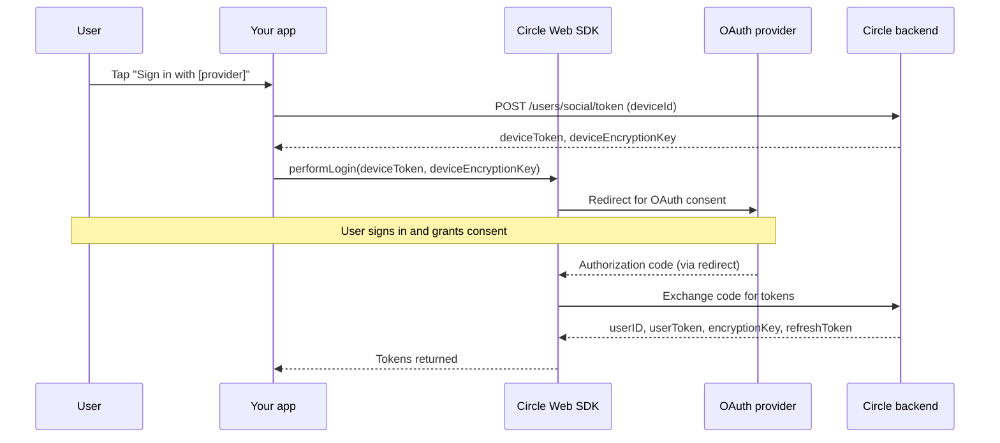
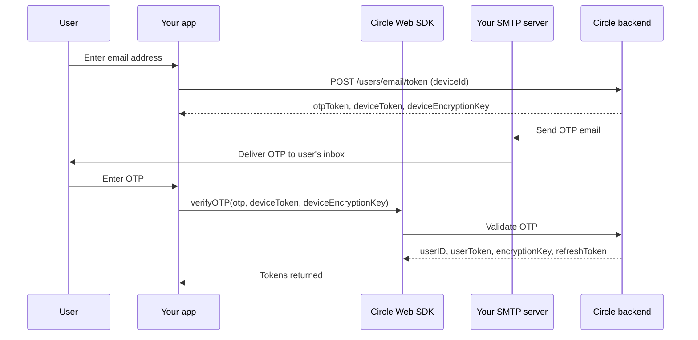

> ## Documentation Index
> Fetch the complete documentation index at: https://developers.circle.com/llms.txt
> Use this file to discover all available pages before exploring further.

# Build a Wallet App

> Build a web app with user-controlled wallets using social login, email OTP, or PIN authentication.

User-controlled wallets support three
[authentication methods](/wallets/user-controlled/authentication-methods), each
with its own integration flow. Pick the tab for the method you want to use.

<Tabs>
  <Tab title="Social login">
    Build a Next.js web app that authenticates users with their Google account and
    creates a user-owned wallet for each authenticated user. The app displays the
    wallet address and the USDC balance it holds.

    ## Prerequisites

    Before you begin this tutorial, ensure you've:

    * Created a [Circle Developer Console](https://console.circle.com/) account.
    * Created a Circle Developer API key:\
      **Console → Keys → Create a key → API key → Standard Key**.
    * Signed in to a Google account for the
      [Google Cloud Console](https://console.cloud.google.com/).
    * Installed [Node.js 22+](https://nodejs.org/).

    ## Step 1. Configure the Google Console

    Set up Google OAuth so users can sign in to your app with their Google account.

    1. Log in to the [Google Cloud Console](https://console.cloud.google.com/)

    2. Click **Select a project → New Project**, enter a name (for example, "Social
       Login Test"), and click **Create**.

    3. Search for **Auth** in the **Google Cloud Search Bar**.

    4. Select **Google Auth Platform**, click **Get started**, and enter:

       * `App name`: for example, "Social Login App"
       * `User support email`: select your email
       * `Audience`: select **External**
       * `Contact email addresses`: type your email again

       Click **Create** after agreeing to the policies.

    5. Select **Create OAuth client**, and enter:

       * `Application type`: select **Web application**
       * `Client name`: for example, "Web client 1"
       * `Authorized redirect URIs`: type `http://localhost:3000`

           <Info>
             Users will be redirected to this URL after they log in with their Google
             account.
           </Info>

       Click **Create** to complete the Google OAuth setup.

    6. Copy the Google OAuth **Client ID**, which identifies your app with Google's
       OAuth service. You need it for the next two steps.

    <Note>
      **Important:** The above Google OAuth setup only allows your account to login
      with Google. If you want other users to authenticate: Select **Audience** from
      your **Google Auth Platform** menu, and click **Publish app**, or add more
      test users individually.
    </Note>

    ## Step 2. Configure the Circle Console

    Connect your Google OAuth client to your Circle Wallets configuration so users
    can sign in through your app, and copy the App ID that identifies your
    user-controlled wallets configuration.

    1. Log in to the [Circle Developer Console](https://console.circle.com/).
    2. Navigate to **Wallets → User Controlled → Configurator**.
    3. Click on **Authentication Methods → Social Logins**, select **Google**.\
       Paste your Google OAuth **Client ID** (from Step 1) into the **Client ID
       (Web)** field.
    4. Go to the **Configurator** page and copy your **App ID**. You need it for the
       next step.

    ## Step 3. Create the web application

    Build a Next.js app that authenticates users through Google OAuth and creates a
    wallet for each authenticated user.

    ### 3.1. Create the Next.js project

    In your terminal:

    ```shell theme={null}
    npx create-next-app@latest circle-social-login --yes
    cd circle-social-login
    ```

    ### 3.2. Install dependencies

    Install the user-controlled wallets Web SDK and supporting packages:

    ```shell theme={null}
    npm install @circle-fin/w3s-pw-web-sdk cookies-next
    ```

    ### 3.3. Add environment variables

    Create a `.env.local` file in the project directory:

    ```shell theme={null}
    touch .env.local
    ```

    Open the `.env.local` file and add the following:

    ```text .env.local theme={null}
    CIRCLE_API_KEY=<YOUR_CIRCLE_API_KEY>
    NEXT_PUBLIC_GOOGLE_CLIENT_ID=<YOUR_GOOGLE_WEB_CLIENT_ID>
    NEXT_PUBLIC_CIRCLE_APP_ID=<YOUR_CIRCLE_APP_ID>
    ```

    * `YOUR_CIRCLE_API_KEY` is your Circle Developer API key.
    * `YOUR_GOOGLE_WEB_CLIENT_ID` is the Google OAuth Client ID created in Step 1.
    * `YOUR_CIRCLE_APP_ID` is the Circle Wallet App ID obtained in Step 2.

    ### 3.4. Simplify the default layout

    Replace the contents of `app/layout.tsx` with the minimal layout below:

    ```ts app/layout.tsx twoslash expandable theme={null}
    // app/layout.tsx
    export default function RootLayout({
      children,
    }: {
      children: React.ReactNode;
    }) {
      return (
        <html lang="en">
          <body>{children}</body>
        </html>
      );
    }
    ```

    <Info>
      Next.js requires an `app/layout.tsx` file, but the default one created by
      `create-next-app` includes fonts and styling that can cause build errors in
      some environments.
    </Info>

    ### 3.5. Add unified backend route

    Create a file named `app/api/endpoints/route.ts` and add the code below:

    ```ts app/api/endpoints/route.ts twoslash expandable theme={null}
    // app/api/endpoints/route.ts
    import { NextResponse } from "next/server";

    const CIRCLE_BASE_URL =
      process.env.NEXT_PUBLIC_CIRCLE_BASE_URL ?? "https://api.circle.com";
    const CIRCLE_API_KEY = process.env.CIRCLE_API_KEY as string;

    export async function POST(request: Request) {
      try {
        const body = await request.json();
        const { action, ...params } = body ?? {};

        if (!action) {
          return NextResponse.json({ error: "Missing action" }, { status: 400 });
        }

        switch (action) {
          case "createDeviceToken": {
            const { deviceId } = params;
            if (!deviceId) {
              return NextResponse.json(
                { error: "Missing deviceId" },
                { status: 400 },
              );
            }

            const response = await fetch(
              `${CIRCLE_BASE_URL}/v1/w3s/users/social/token`,
              {
                method: "POST",
                headers: {
                  "Content-Type": "application/json",
                  Authorization: `Bearer ${CIRCLE_API_KEY}`,
                },
                body: JSON.stringify({
                  idempotencyKey: crypto.randomUUID(),
                  deviceId,
                }),
              },
            );

            const data = await response.json();

            if (!response.ok) {
              return NextResponse.json(data, { status: response.status });
            }

            // Returns: { deviceToken, deviceEncryptionKey }
            return NextResponse.json(data.data, { status: 200 });
          }

          case "initializeUser": {
            const { userToken } = params;
            if (!userToken) {
              return NextResponse.json(
                { error: "Missing userToken" },
                { status: 400 },
              );
            }

            const response = await fetch(
              `${CIRCLE_BASE_URL}/v1/w3s/user/initialize`,
              {
                method: "POST",
                headers: {
                  "Content-Type": "application/json",
                  Authorization: `Bearer ${CIRCLE_API_KEY}`,
                  "X-User-Token": userToken,
                },
                body: JSON.stringify({
                  idempotencyKey: crypto.randomUUID(),
                  accountType: "SCA",
                  blockchains: ["ARC-TESTNET"],
                }),
              },
            );

            const data = await response.json();

            if (!response.ok) {
              // Pass through Circle error payload (e.g. code 155106: user already initialized)
              return NextResponse.json(data, { status: response.status });
            }

            // Returns: { challengeId }
            return NextResponse.json(data.data, { status: 200 });
          }

          case "listWallets": {
            const { userToken } = params;
            if (!userToken) {
              return NextResponse.json(
                { error: "Missing userToken" },
                { status: 400 },
              );
            }

            const response = await fetch(`${CIRCLE_BASE_URL}/v1/w3s/wallets`, {
              method: "GET",
              headers: {
                accept: "application/json",
                "content-type": "application/json",
                Authorization: `Bearer ${CIRCLE_API_KEY}`,
                "X-User-Token": userToken,
              },
            });

            const data = await response.json();

            if (!response.ok) {
              return NextResponse.json(data, { status: response.status });
            }

            // Returns: { wallets: [...] }
            return NextResponse.json(data.data, { status: 200 });
          }

          case "getTokenBalance": {
            const { userToken, walletId } = params;
            if (!userToken || !walletId) {
              return NextResponse.json(
                { error: "Missing userToken or walletId" },
                { status: 400 },
              );
            }

            const response = await fetch(
              `${CIRCLE_BASE_URL}/v1/w3s/wallets/${walletId}/balances`,
              {
                method: "GET",
                headers: {
                  accept: "application/json",
                  Authorization: `Bearer ${CIRCLE_API_KEY}`,
                  "X-User-Token": userToken,
                },
              },
            );

            const data = await response.json();

            if (!response.ok) {
              return NextResponse.json(data, { status: response.status });
            }

            // Returns: { tokenBalances: [...] }
            return NextResponse.json(data.data, { status: 200 });
          }

          default:
            return NextResponse.json(
              { error: `Unknown action: ${action}` },
              { status: 400 },
            );
        }
      } catch (error) {
        console.log("Error in /api/endpoints:", error);
        return NextResponse.json(
          { error: "Internal server error" },
          { status: 500 },
        );
      }
    }
    ```

    This route serves as a single backend entry point for all Circle API endpoints
    used by the app, mapping frontend actions to thin wrapper handlers that call the
    corresponding endpoints:

    | Handler             | Description                                                                                                                                                                                                    |
    | ------------------- | -------------------------------------------------------------------------------------------------------------------------------------------------------------------------------------------------------------- |
    | `createDeviceToken` | calls [POST /v1/w3s/users/social/token](/api-reference/wallets/user-controlled-wallets/create-device-token-social-login) to create a device-bound session used by the Web SDK for social login authentication. |
    | `initializeUser`    | calls [POST /v1/w3s/user/initialize](/api-reference/wallets/user-controlled-wallets/create-user-with-pin-challenge) to create or initialize a user and return a `challengeId` required for wallet creation.    |
    | `listWallets`       | calls [GET /v1/w3s/wallets](/api-reference/wallets/user-controlled-wallets/list-wallets) to retrieve the wallets associated with the authenticated user.                                                       |
    | `getTokenBalance`   | calls [GET /v1/w3s/wallets/{walletId_0}/balances](/api-reference/wallets/user-controlled-wallets/list-wallet-balance) to retrieve digital asset balances for the specified user-controlled wallet.             |

    <Info>
      This quickstart calls `listWallets` and `getTokenBalance` directly for
      simplicity. In production, apps typically store wallet and balance data in a
      backend database and keep it in sync using Circle webhooks for scalability.
    </Info>

    To understand how the request fields and response data for these handlers and
    their corresponding endpoints are used, follow the app flow in
    [Step 4](#step-4-run-the-app-flow) below.

    ### ​3.6. Add UI and frontend code

    Replace the contents of `app/page.tsx` with the code below:

    ```ts app/page.tsx twoslash expandable theme={null}
    // app/page.tsx
    "use client";

    import { useEffect, useRef, useState } from "react";
    import { setCookie, getCookie } from "cookies-next";
    import { SocialLoginProvider } from "@circle-fin/w3s-pw-web-sdk/dist/src/types";
    import type { W3SSdk } from "@circle-fin/w3s-pw-web-sdk";

    const appId = process.env.NEXT_PUBLIC_CIRCLE_APP_ID as string;
    const googleClientId = process.env.NEXT_PUBLIC_GOOGLE_CLIENT_ID as string;

    type LoginResult = {
      userToken: string;
      encryptionKey: string;
      // other fields (refreshToken, oAuthInfo, etc.) are ignored in this quickstart
    };

    type Wallet = {
      id: string;
      address: string;
      blockchain: string;
      [key: string]: unknown;
    };

    export default function HomePage() {
      const sdkRef = useRef<W3SSdk | null>(null);

      const [sdkReady, setSdkReady] = useState(false);
      const [deviceId, setDeviceId] = useState<string>("");
      const [deviceIdLoading, setDeviceIdLoading] = useState(false);

      const [deviceToken, setDeviceToken] = useState<string>("");
      const [deviceEncryptionKey, setDeviceEncryptionKey] = useState<string>("");

      const [loginResult, setLoginResult] = useState<LoginResult | null>(null);
      const [loginError, setLoginError] = useState<string | null>(null);

      const [challengeId, setChallengeId] = useState<string | null>(null);
      const [wallets, setWallets] = useState<Wallet[]>([]);
      const [usdcBalance, setUsdcBalance] = useState<string | null>(null);
      const [status, setStatus] = useState<string>("Ready");

      // Initialize SDK on mount, using cookies to restore config after redirect
      useEffect(() => {
        let cancelled = false;

        const initSdk = async () => {
          try {
            const { W3SSdk } = await import("@circle-fin/w3s-pw-web-sdk");

            const onLoginComplete = (error: unknown, result: any) => {
              if (cancelled) return;

              if (error) {
                const err = error as any;
                console.log("Login failed:", err);
                setLoginError(err.message || "Login failed");
                setLoginResult(null);
                setStatus("Login failed");
                return;
              }

              setLoginResult({
                userToken: result.userToken,
                encryptionKey: result.encryptionKey,
              });
              setLoginError(null);
              setStatus("Login successful. Credentials received from Google.");
            };

            const restoredAppId = (getCookie("appId") as string) || appId || "";
            const restoredGoogleClientId =
              (getCookie("google.clientId") as string) || googleClientId || "";
            const restoredDeviceToken = (getCookie("deviceToken") as string) || "";
            const restoredDeviceEncryptionKey =
              (getCookie("deviceEncryptionKey") as string) || "";

            const initialConfig = {
              appSettings: { appId: restoredAppId },
              loginConfigs: {
                deviceToken: restoredDeviceToken,
                deviceEncryptionKey: restoredDeviceEncryptionKey,
                google: {
                  clientId: restoredGoogleClientId,
                  redirectUri:
                    typeof window !== "undefined" ? window.location.origin : "",
                  selectAccountPrompt: true,
                },
              },
            };

            const sdk = new W3SSdk(initialConfig, onLoginComplete);
            sdkRef.current = sdk;

            if (!cancelled) {
              setSdkReady(true);
              setStatus("SDK initialized. Ready to create device token.");
            }
          } catch (err) {
            console.log("Failed to initialize Web SDK:", err);
            if (!cancelled) {
              setStatus("Failed to initialize Web SDK");
            }
          }
        };

        void initSdk();

        return () => {
          cancelled = true;
        };
      }, []);

      // Get / cache deviceId
      useEffect(() => {
        const fetchDeviceId = async () => {
          if (!sdkRef.current) return;

          try {
            const cached =
              typeof window !== "undefined"
                ? window.localStorage.getItem("deviceId")
                : null;

            if (cached) {
              setDeviceId(cached);
              return;
            }

            setDeviceIdLoading(true);
            const id = await sdkRef.current.getDeviceId();
            setDeviceId(id);

            if (typeof window !== "undefined") {
              window.localStorage.setItem("deviceId", id);
            }
          } catch (error) {
            console.log("Failed to get deviceId:", error);
            setStatus("Failed to get deviceId");
          } finally {
            setDeviceIdLoading(false);
          }
        };

        if (sdkReady) {
          void fetchDeviceId();
        }
      }, [sdkReady]);

      // Helper to load USDC balance for a wallet
      async function loadUsdcBalance(userToken: string, walletId: string) {
        try {
          const response = await fetch("/api/endpoints", {
            method: "POST",
            headers: { "Content-Type": "application/json" },
            body: JSON.stringify({
              action: "getTokenBalance",
              userToken,
              walletId,
            }),
          });

          const data = await response.json();

          if (!response.ok) {
            console.log("Failed to load USDC balance:", data);
            setStatus("Failed to load USDC balance");
            return null;
          }

          const balances = (data.tokenBalances as any[]) || [];

          const usdcEntry =
            balances.find((t) => {
              const symbol = t.token?.symbol || "";
              const name = t.token?.name || "";
              return symbol.startsWith("USDC") || name.includes("USDC");
            }) ?? null;

          const amount = usdcEntry?.amount ?? "0";
          setUsdcBalance(amount);
          return amount;
        } catch (err) {
          console.log("Failed to load USDC balance:", err);
          setStatus("Failed to load USDC balance");
          return null;
        }
      }

      // Helper to load wallets for the current user
      const loadWallets = async (
        userToken: string,
        options?: { source?: "afterCreate" | "alreadyInitialized" },
      ) => {
        try {
          setStatus("Loading wallet details...");
          setUsdcBalance(null);

          const response = await fetch("/api/endpoints", {
            method: "POST",
            headers: { "Content-Type": "application/json" },
            body: JSON.stringify({
              action: "listWallets",
              userToken,
            }),
          });

          const data = await response.json();

          if (!response.ok) {
            console.log("List wallets failed:", data);
            setStatus("Failed to load wallet details");
            return;
          }

          const wallets = (data.wallets as Wallet[]) || [];
          setWallets(wallets);

          if (wallets.length > 0) {
            // Load USDC balance for the primary wallet
            await loadUsdcBalance(userToken, wallets[0].id);

            if (options?.source === "afterCreate") {
              setStatus(
                "Wallet created successfully! 🎉 Wallet details and USDC balance loaded.",
              );
            } else if (options?.source === "alreadyInitialized") {
              setStatus(
                "User already initialized. Wallet details and USDC balance loaded.",
              );
            } else {
              setStatus("Wallet details and USDC balance loaded.");
            }
          } else {
            setStatus("No wallets found for this user.");
          }
        } catch (err) {
          console.log("Failed to load wallet details:", err);
          setStatus("Failed to load wallet details");
        }
      };

      const handleCreateDeviceToken = async () => {
        if (!deviceId) {
          setStatus("Missing deviceId");
          return;
        }

        try {
          setStatus("Creating device token...");
          const response = await fetch("/api/endpoints", {
            method: "POST",
            headers: { "Content-Type": "application/json" },
            body: JSON.stringify({
              action: "createDeviceToken",
              deviceId,
            }),
          });

          const data = await response.json();

          if (!response.ok) {
            console.log("Create device token failed:", data);
            setStatus("Failed to create device token");
            return;
          }

          setDeviceToken(data.deviceToken);
          setDeviceEncryptionKey(data.deviceEncryptionKey);

          setCookie("deviceToken", data.deviceToken);
          setCookie("deviceEncryptionKey", data.deviceEncryptionKey);

          setStatus("Device token created");
        } catch (err) {
          console.log("Error creating device token:", err);
          setStatus("Failed to create device token");
        }
      };

      const handleLoginWithGoogle = () => {
        const sdk = sdkRef.current;
        if (!sdk) {
          setStatus("SDK not ready");
          return;
        }

        if (!deviceToken || !deviceEncryptionKey) {
          setStatus("Missing deviceToken or deviceEncryptionKey");
          return;
        }

        // Persist configs so SDK can rehydrate after redirect
        setCookie("appId", appId);
        setCookie("google.clientId", googleClientId);
        setCookie("deviceToken", deviceToken);
        setCookie("deviceEncryptionKey", deviceEncryptionKey);

        sdk.updateConfigs({
          appSettings: {
            appId,
          },
          loginConfigs: {
            deviceToken,
            deviceEncryptionKey,
            google: {
              clientId: googleClientId,
              redirectUri: window.location.origin,
              selectAccountPrompt: true,
            },
          },
        });

        setStatus("Redirecting to Google...");
        sdk.performLogin(SocialLoginProvider.GOOGLE);
      };

      const handleInitializeUser = async () => {
        if (!loginResult?.userToken) {
          setStatus("Missing userToken. Please login with Google first.");
          return;
        }

        try {
          setStatus("Initializing user...");

          const response = await fetch("/api/endpoints", {
            method: "POST",
            headers: { "Content-Type": "application/json" },
            body: JSON.stringify({
              action: "initializeUser",
              userToken: loginResult.userToken,
            }),
          });

          const data = await response.json();

          if (!response.ok) {
            // 155106 = user already initialized
            if (data.code === 155106) {
              // User already initialized; load wallet details instead of trying to create again
              await loadWallets(loginResult.userToken, {
                source: "alreadyInitialized",
              });
              // No challenge to execute when wallet already exists
              setChallengeId(null);
              return;
            }

            const errorMsg = data.code
              ? `[${data.code}] ${data.error || data.message}`
              : data.error || data.message;
            setStatus("Failed to initialize user: " + errorMsg);
            return;
          }

          // Successful initialization → get challengeId
          setChallengeId(data.challengeId);
          setStatus(`User initialized. challengeId: ${data.challengeId}`);
        } catch (err) {
          const error = err as any;

          if (error?.code === 155106 && loginResult?.userToken) {
            await loadWallets(loginResult.userToken, {
              source: "alreadyInitialized",
            });
            setChallengeId(null);
            return;
          }

          const errorMsg = error?.code
            ? `[${error.code}] ${error.message}`
            : error?.message || "Unknown error";
          setStatus("Failed to initialize user: " + errorMsg);
        }
      };

      const handleExecuteChallenge = () => {
        const sdk = sdkRef.current;
        if (!sdk) {
          setStatus("SDK not ready");
          return;
        }

        if (!challengeId) {
          setStatus("Missing challengeId. Initialize user first.");
          return;
        }

        if (!loginResult?.userToken || !loginResult?.encryptionKey) {
          setStatus("Missing login credentials. Please login again.");
          return;
        }

        sdk.setAuthentication({
          userToken: loginResult.userToken,
          encryptionKey: loginResult.encryptionKey,
        });

        setStatus("Executing challenge...");

        sdk.execute(challengeId, (error) => {
          const err = (error || {}) as any;

          if (error) {
            console.log("Execute challenge failed:", err);
            setStatus(
              "Failed to execute challenge: " + (err?.message ?? "Unknown error"),
            );
            return;
          }

          setStatus("Challenge executed. Loading wallet details...");

          void (async () => {
            // small delay to give Circle time to index the wallet
            await new Promise((resolve) => setTimeout(resolve, 2000));

            // Challenge consumed; clear it and load wallet details (and balance)
            setChallengeId(null);
            await loadWallets(loginResult.userToken, { source: "afterCreate" });
          })().catch((e) => {
            console.log("Post-execute follow-up failed:", e);
            setStatus("Wallet created, but failed to load wallet details.");
          });
        });
      };

      const primaryWallet = wallets[0];

      return (
        <main>
          <div style={{ width: "50%", margin: "0 auto" }}>
            <h1>Create a user wallet with Google social login</h1>
            <p>Follow the buttons below to complete the flow:</p>

            <div>
              <button
                onClick={handleCreateDeviceToken}
                style={{ margin: "6px" }}
                disabled={!sdkReady || !deviceId || deviceIdLoading}
              >
                1. Create device token
              </button>
              <br />
              <button
                onClick={handleLoginWithGoogle}
                style={{ margin: "6px" }}
                disabled={!deviceToken || !deviceEncryptionKey}
              >
                2. Login with Google
              </button>
              <br />
              <button
                onClick={handleInitializeUser}
                style={{ margin: "6px" }}
                disabled={!loginResult || wallets.length > 0}
              >
                3. Initialize user (get challenge)
              </button>
              <br />
              <button
                onClick={handleExecuteChallenge}
                style={{ margin: "6px" }}
                disabled={!challengeId || wallets.length > 0}
              >
                4. Create wallet (execute challenge)
              </button>
            </div>

            <p>
              <strong>Status:</strong> {status}
            </p>

            {loginError && (
              <p style={{ color: "red" }}>
                <strong>Error:</strong> {loginError}
              </p>
            )}

            {primaryWallet && (
              <div style={{ marginTop: "12px" }}>
                <h2>Wallet details</h2>
                <p>
                  <strong>Address:</strong> {primaryWallet.address}
                </p>
                <p>
                  <strong>Blockchain:</strong> {primaryWallet.blockchain}
                </p>
                {usdcBalance !== null && (
                  <p>
                    <strong>USDC balance:</strong> {usdcBalance}
                  </p>
                )}
              </div>
            )}

            <pre
              style={{
                whiteSpace: "pre-wrap",
                wordBreak: "break-all",
                lineHeight: "1.8",
                marginTop: "16px",
              }}
            >
              {JSON.stringify(
                {
                  deviceId,
                  deviceToken,
                  deviceEncryptionKey,
                  userToken: loginResult?.userToken,
                  encryptionKey: loginResult?.encryptionKey,
                  challengeId,
                  wallets,
                  usdcBalance,
                },
                null,
                2,
              )}
            </pre>
          </div>
        </main>
      );
    }
    ```

    This page renders the UI and implements all browser-side logic for the Google
    social login and wallet creation flow. It initializes the Web SDK, processes the
    Google OAuth redirect, manages short-lived state across redirects, and
    coordinates the sequence of actions required to create and display the wallet.

    ## Step 4. Run the app flow

    1. Start the dev server:

    ```shell theme={null}
    npm run dev
    ```

    2. Open [http://localhost:3000](http://localhost:3000) in your browser to view the app.

    3) Complete the Google authentication and wallet creation flow:
       1. Click **Create device token**: The Web SDK generates a unique `deviceId`,
          which identifies the user's browser. Your backend exchanges the `deviceId`
          for temporary verification tokens (`deviceToken`, `deviceEncryptionKey`)
          used by the Web SDK to allow Google authentication.
       2. Click **Login with Google**: The Web SDK starts the Google OAuth
          authentication process. After the user signs in with Google, the SDK sends
          the OAuth result to Circle. Circle validates the login and returns a
          `userToken` and `encryptionKey`, which together represent an authenticated
          Circle user session.
       3. Click **Initialize user**: Your backend initializes the user using the
          `userToken`. If the user hasn't created a wallet yet, Circle returns a
          `challengeId` to create one. If the user is already initialized, the app
          loads the existing wallet instead.
       4. Click **Create wallet**: The Web SDK executes the challenge using the
          `challengeId`. The user approves the action, and Circle creates the
          wallet.

    4) Once the flow completes:
       * The app displays the wallet address, blockchain, and USDC balance.
       * You can verify the user was created in the
         [Circle Dev Console](https://console.circle.com/):\
         **Wallets → User Controlled → Users**.

    ## Step 5. Fund the wallet

    Fund the new wallet manually through the Circle Faucet and confirm the updated
    balance in the app.

    1. Copy the wallet address (`0x...`) from the web app UI.
    2. Visit the official [Circle Faucet](https://faucet.circle.com/).
    3. Select **Arc Testnet** as the blockchain network.
    4. Paste the wallet address in the **Send to** field.
    5. Click **Send USDC**.
    6. Return to the app and walk through the flow again.\
       **Note:** Use the same Google account to show the same wallet.
    7. The app will display the updated USDC balance.

    <Note>
      In this step, you're acting as the end user to fund your user-controlled
      wallet for testing. In production, app developers don't control user wallets
      or private keys. Instead, users typically fund wallets themselves, but apps
      may also fund using faucets or airdrops without requiring wallet access.
    </Note>
  </Tab>

  <Tab title="Email OTP">
    Build a Next.js web app that authenticates users with a one-time passcode (OTP)
    sent to their email and creates a user-owned wallet for each authenticated user.
    The app displays the wallet address and the USDC balance it holds.

    ## Prerequisites

    Before you begin this tutorial, ensure you've:

    * Created a [Mailtrap](https://mailtrap.io/) account with **Email Sandbox**
      enabled.
    * Created a [Circle Developer Console](https://console.circle.com/) account.
    * Created a Circle Developer API key:\
      **Console → Keys → Create a key → API key → Standard Key**.
    * Installed [Node.js 22+](https://nodejs.org/).

    ## Step 1. Get Mailtrap SMTP credentials

    Copy SMTP credentials from Mailtrap so Circle can send OTP codes to users.

    1. Log in to your [Mailtrap](https://mailtrap.io/) account.
    2. In the left navigation, click **Transactional → Sandboxes**.
    3. Open the default sandbox project (**My Sandbox**) or create a new one.
    4. In the sandbox view, select the **SMTP Settings** tab.
    5. Copy the following SMTP values:

       * **Host**
       * **Port**
       * **Username**
       * **Password**

       You need them for the next step.

    ## Step 2. Configure the Circle Console

    Add your Mailtrap SMTP credentials to the Circle Console so Circle can send OTP
    emails, and copy the App ID that identifies your user-controlled wallets
    configuration.

    1. Log in to the [Circle Developer Console](https://console.circle.com/).
    2. Navigate to **Wallets → User Controlled → Configurator**.
    3. Under **Authentication Methods**, click **Email**.
    4. Enter a **From** email address (for example, `no-reply@example.com`).
    5. Enter the SMTP values you copied from Mailtrap:
       * **Host**
       * **Port**
       * **Username**
       * **Password**
    6. (Optional) Customize your OTP email from, subject, and message body.
    7. Go to the **Configurator** page and copy your **App ID**. You need it for the
       next step.

    ## Step 3. Create the web application

    Build a Next.js app that authenticates users with an OTP sent to their email and
    creates a wallet for each authenticated user.

    ### 3.1. Create the Next.js project

    In your terminal:

    ```shell theme={null}
    npx create-next-app@latest circle-email-otp --yes
    cd circle-email-otp
    ```

    ### 3.2. Install dependencies

    Install the user-controlled wallets Web SDK:

    ```shell theme={null}
    npm install @circle-fin/w3s-pw-web-sdk
    ```

    ### 3.3. Add environment variables

    Create a `.env.local` file in your project directory:

    ```shell theme={null}
    touch .env.local
    ```

    Open the `.env.local` file and add the following:

    ```text .env.local theme={null}
    CIRCLE_API_KEY=<YOUR_CIRCLE_API_KEY>
    NEXT_PUBLIC_CIRCLE_APP_ID=<YOUR_CIRCLE_APP_ID>
    ```

    * `YOUR_CIRCLE_API_KEY` is your Circle Developer API key.
    * `YOUR_CIRCLE_APP_ID` is the Circle Wallet App ID obtained in Step 2.

    ### 3.4. Simplify the default layout

    Replace the contents of `app/layout.tsx` with the minimal layout below:

    ```ts app/layout.tsx twoslash expandable theme={null}
    // app/layout.tsx
    export default function RootLayout({
      children,
    }: {
      children: React.ReactNode;
    }) {
      return (
        <html lang="en">
          <body>{children}</body>
        </html>
      );
    }
    ```

    <Info>
      Next.js requires an `app/layout.tsx` file, but the default one created by
      `create-next-app` includes fonts and styling that can cause build errors in
      some environments.
    </Info>

    ### 3.5. Add unified backend route

    Create a file named `app/api/endpoints/route.ts` and add the code below:

    ```ts app/api/endpoints/route.ts twoslash expandable theme={null}
    // app/api/endpoints/route.ts
    import { NextResponse } from "next/server";

    const CIRCLE_BASE_URL =
      process.env.NEXT_PUBLIC_CIRCLE_BASE_URL ?? "https://api.circle.com";
    const CIRCLE_API_KEY = process.env.CIRCLE_API_KEY as string;

    export async function POST(request: Request) {
      try {
        const body = await request.json();
        const { action, ...params } = body ?? {};

        if (!action) {
          return NextResponse.json({ error: "Missing action" }, { status: 400 });
        }

        switch (action) {
          case "requestEmailOtp": {
            const { deviceId, email } = params;
            if (!deviceId || !email) {
              return NextResponse.json(
                { error: "Missing deviceId or email" },
                { status: 400 },
              );
            }

            const response = await fetch(
              `${CIRCLE_BASE_URL}/v1/w3s/users/email/token`,
              {
                method: "POST",
                headers: {
                  "Content-Type": "application/json",
                  Authorization: `Bearer ${CIRCLE_API_KEY}`,
                },
                body: JSON.stringify({
                  idempotencyKey: crypto.randomUUID(),
                  deviceId,
                  email,
                }),
              },
            );

            const data = await response.json();
            if (!response.ok) {
              return NextResponse.json(data, { status: response.status });
            }

            // { deviceToken, deviceEncryptionKey, otpToken }
            return NextResponse.json(data.data, { status: 200 });
          }

          case "initializeUser": {
            const { userToken } = params;
            if (!userToken) {
              return NextResponse.json(
                { error: "Missing userToken" },
                { status: 400 },
              );
            }

            const response = await fetch(
              `${CIRCLE_BASE_URL}/v1/w3s/user/initialize`,
              {
                method: "POST",
                headers: {
                  "Content-Type": "application/json",
                  Authorization: `Bearer ${CIRCLE_API_KEY}`,
                  "X-User-Token": userToken,
                },
                body: JSON.stringify({
                  idempotencyKey: crypto.randomUUID(),
                  accountType: "SCA",
                  blockchains: ["ARC-TESTNET"],
                }),
              },
            );

            const data = await response.json();

            if (!response.ok) {
              // e.g. 155106 user already initialized
              return NextResponse.json(data, { status: response.status });
            }

            // { challengeId }
            return NextResponse.json(data.data, { status: 200 });
          }

          case "listWallets": {
            const { userToken } = params;
            if (!userToken) {
              return NextResponse.json(
                { error: "Missing userToken" },
                { status: 400 },
              );
            }

            const response = await fetch(`${CIRCLE_BASE_URL}/v1/w3s/wallets`, {
              method: "GET",
              headers: {
                accept: "application/json",
                "content-type": "application/json",
                Authorization: `Bearer ${CIRCLE_API_KEY}`,
                "X-User-Token": userToken,
              },
            });

            const data = await response.json();

            if (!response.ok) {
              return NextResponse.json(data, { status: response.status });
            }

            // { wallets: [...] }
            return NextResponse.json(data.data, { status: 200 });
          }

          case "getTokenBalance": {
            const { userToken, walletId } = params;
            if (!userToken || !walletId) {
              return NextResponse.json(
                { error: "Missing userToken or walletId" },
                { status: 400 },
              );
            }

            const response = await fetch(
              `${CIRCLE_BASE_URL}/v1/w3s/wallets/${walletId}/balances`,
              {
                method: "GET",
                headers: {
                  accept: "application/json",
                  Authorization: `Bearer ${CIRCLE_API_KEY}`,
                  "X-User-Token": userToken,
                },
              },
            );

            const data = await response.json();

            if (!response.ok) {
              return NextResponse.json(data, { status: response.status });
            }

            // { tokenBalances: [...] }
            return NextResponse.json(data.data, { status: 200 });
          }

          default:
            return NextResponse.json(
              { error: `Unknown action: ${action}` },
              { status: 400 },
            );
        }
      } catch (error) {
        console.error("Error in /api/endpoints:", error);
        return NextResponse.json(
          { error: "Internal server error" },
          { status: 500 },
        );
      }
    }
    ```

    This route serves as a single backend entry point for all Circle API endpoints
    used by the app, mapping frontend actions to thin wrapper handlers that call the
    corresponding endpoints:

    | Handler           | Description                                                                                                                                                                                                                                                     |
    | ----------------- | --------------------------------------------------------------------------------------------------------------------------------------------------------------------------------------------------------------------------------------------------------------- |
    | `requestEmailOtp` | calls [POST /v1/w3s/users/email/token](/api-reference/wallets/user-controlled-wallets/create-device-token-email-login) to initiate email authentication and return temporary verification tokens required by the Web SDK to verify the OTP entered by the user. |
    | `initializeUser`  | calls [POST /v1/w3s/user/initialize](/api-reference/wallets/user-controlled-wallets/create-user-with-pin-challenge) to create or initialize a user and return a `challengeId` required for wallet creation.                                                     |
    | `listWallets`     | calls [GET /v1/w3s/wallets](/api-reference/wallets/user-controlled-wallets/list-wallets) to retrieve the wallets associated with the authenticated user.                                                                                                        |
    | `getTokenBalance` | calls [GET /v1/w3s/wallets/{walletId_1}/balances](/api-reference/wallets/user-controlled-wallets/list-wallet-balance) to retrieve digital asset balances for the specified user-controlled wallet.                                                              |

    <Info>
      This quickstart calls `listWallets` and `getTokenBalance` directly for
      simplicity. In production, apps typically store wallet and balance data in a
      backend database and keep it in sync using Circle webhooks for scalability.
    </Info>

    To understand how the request fields and response data for these handlers and
    their corresponding endpoints are used, follow the app flow in
    [Step 4](#step-4-run-the-app-flow-2) below.

    ### ​3.6. Add UI and frontend code

    Replace the contents of `app/page.tsx` with the code below:

    ```ts app/page.tsx twoslash expandable theme={null}
    // app/page.tsx
    "use client";

    import { useEffect, useRef, useState } from "react";
    import { W3SSdk } from "@circle-fin/w3s-pw-web-sdk";

    const appId = process.env.NEXT_PUBLIC_CIRCLE_APP_ID as string;

    type LoginResult = {
      userToken: string;
      encryptionKey: string;
    };

    type Wallet = {
      id: string;
      address: string;
      blockchain: string;
      [key: string]: unknown;
    };

    export default function HomePage() {
      const sdkRef = useRef<W3SSdk | null>(null);

      const [sdkReady, setSdkReady] = useState(false);
      const [deviceId, setDeviceId] = useState<string>("");
      const [deviceIdLoading, setDeviceIdLoading] = useState(false);

      const [email, setEmail] = useState<string>("");

      const [deviceToken, setDeviceToken] = useState<string>("");
      const [deviceEncryptionKey, setDeviceEncryptionKey] = useState<string>("");
      const [otpToken, setOtpToken] = useState<string>("");

      const [loginResult, setLoginResult] = useState<LoginResult | null>(null);

      const [challengeId, setChallengeId] = useState<string | null>(null);
      const [wallets, setWallets] = useState<Wallet[]>([]);
      const [usdcBalance, setUsdcBalance] = useState<string | null>(null);

      const [status, setStatus] = useState<string>("Ready");
      const [isError, setIsError] = useState<boolean>(false);

      // Initialize SDK on mount
      useEffect(() => {
        let cancelled = false;

        const initSdk = async () => {
          try {
            const onLoginComplete = (error: unknown, result: any) => {
              if (cancelled) return;

              if (error || !result) {
                // Always treat this as a soft failure
                const err = (error || {}) as any;
                const message: string =
                  err?.message || "Email authentication failed.";

                console.log("Email auth failed:", {
                  code: err?.code,
                  message,
                });

                setIsError(true);
                setStatus(message);
                setLoginResult(null);
                return;
              }

              // Success: we get userToken + encryptionKey for challenges
              setLoginResult({
                userToken: result.userToken,
                encryptionKey: result.encryptionKey,
              });
              setIsError(false);
              // Keep this neutral so later wallet-status messages aren't confusing
              setStatus("Email verified. Click Initialize user to continue");
            };

            const sdk = new W3SSdk(
              {
                appSettings: { appId },
              },
              onLoginComplete,
            );

            sdkRef.current = sdk;

            if (!cancelled) {
              setSdkReady(true);
              setIsError(false);
              setStatus("SDK initialized. Ready to request OTP.");
            }
          } catch (err) {
            console.log("Failed to initialize Web SDK:", err);
            if (!cancelled) {
              setIsError(true);
              setStatus("Failed to initialize Web SDK");
            }
          }
        };

        void initSdk();

        return () => {
          cancelled = true;
        };
      }, []);

      // Get / cache deviceId
      useEffect(() => {
        const fetchDeviceId = async () => {
          if (!sdkRef.current) return;

          try {
            const cached =
              typeof window !== "undefined"
                ? window.localStorage.getItem("deviceId")
                : null;

            if (cached) {
              setDeviceId(cached);
              return;
            }

            setDeviceIdLoading(true);
            const id = await sdkRef.current.getDeviceId();
            setDeviceId(id);

            if (typeof window !== "undefined") {
              window.localStorage.setItem("deviceId", id);
            }
          } catch (error) {
            console.log("Failed to get deviceId:", error);
            setIsError(true);
            setStatus("Failed to get deviceId");
          } finally {
            setDeviceIdLoading(false);
          }
        };

        if (sdkReady) {
          void fetchDeviceId();
        }
      }, [sdkReady]);

      // Load USDC balance
      async function loadUsdcBalance(userToken: string, walletId: string) {
        try {
          const response = await fetch("/api/endpoints", {
            method: "POST",
            headers: { "Content-Type": "application/json" },
            body: JSON.stringify({
              action: "getTokenBalance",
              userToken,
              walletId,
            }),
          });

          const data = await response.json();

          if (!response.ok) {
            console.log("Failed to load USDC balance:", data);
            setIsError(true);
            setStatus("Failed to load USDC balance");
            return null;
          }

          const balances = (data.tokenBalances as any[]) || [];

          const usdcEntry =
            balances.find((t) => {
              const symbol = t.token?.symbol || "";
              const name = t.token?.name || "";
              return symbol.startsWith("USDC") || name.includes("USDC");
            }) ?? null;

          const amount = usdcEntry?.amount ?? "0";
          setUsdcBalance(amount);
          // Note: loadWallets may overwrite this with a more specific status
          setIsError(false);
          setStatus("Wallet details and USDC balance loaded.");
          return amount;
        } catch (err) {
          console.log("Failed to load USDC balance:", err);
          setIsError(true);
          setStatus("Failed to load USDC balance");
          return null;
        }
      }

      // Load wallets for current user
      const loadWallets = async (
        userToken: string,
        options?: { source?: "afterCreate" | "alreadyInitialized" },
      ) => {
        try {
          setIsError(false);
          setStatus("Loading wallet details...");
          setUsdcBalance(null);

          const response = await fetch("/api/endpoints", {
            method: "POST",
            headers: { "Content-Type": "application/json" },
            body: JSON.stringify({
              action: "listWallets",
              userToken,
            }),
          });

          const data = await response.json();

          if (!response.ok) {
            console.log("List wallets failed:", data);
            setIsError(true);
            setStatus("Failed to load wallet details");
            return;
          }

          const wallets = (data.wallets as Wallet[]) || [];
          setWallets(wallets);

          if (wallets.length > 0) {
            await loadUsdcBalance(userToken, wallets[0].id);

            if (options?.source === "afterCreate") {
              setIsError(false);
              setStatus(
                "Wallet created successfully! 🎉 Wallet details and USDC balance loaded.",
              );
            } else if (options?.source === "alreadyInitialized") {
              setIsError(false);
              setStatus(
                "User already initialized. Wallet details and USDC balance loaded.",
              );
            }
          } else {
            setIsError(false);
            setStatus("Wallet creation in progress. Click Initialize user again to refresh.");
          }
        } catch (err) {
          console.log("Failed to load wallet details:", err);
          setIsError(true);
          setStatus("Failed to load wallet details");
        }
      };

      const handleRequestOtp = async () => {
        if (!email) {
          setIsError(true);
          setStatus("Please enter an email address.");
          return;
        }

        if (!deviceId) {
          setIsError(true);
          setStatus("Missing deviceId. Try again.");
          return;
        }

        // Reset auth + wallet state
        setLoginResult(null);
        setChallengeId(null);
        setWallets([]);
        setUsdcBalance(null);

        try {
          setIsError(false);
          setStatus("Requesting OTP...");

          const response = await fetch("/api/endpoints", {
            method: "POST",
            headers: { "Content-Type": "application/json" },
            body: JSON.stringify({
              action: "requestEmailOtp",
              deviceId,
              email,
            }),
          });

          const data = await response.json();

          if (!response.ok) {
            console.log("Failed to request OTP:", data);
            setIsError(true);
            setStatus(data.error || data.message || "Failed to request OTP");
            return;
          }

          setDeviceToken(data.deviceToken);
          setDeviceEncryptionKey(data.deviceEncryptionKey);
          setOtpToken(data.otpToken);

          // Give the SDK the session info so verifyOtp() works
          const sdk = sdkRef.current;
          if (sdk) {
            sdk.updateConfigs({
              appSettings: { appId },
              loginConfigs: {
                deviceToken: data.deviceToken,
                deviceEncryptionKey: data.deviceEncryptionKey,
                otpToken: data.otpToken,
                email: { email },
              },
            });
          }

          setIsError(false);
          setStatus(
            "OTP sent! Check your Mailtrap sandbox inbox, then click Verify email OTP.",
          );
        } catch (err) {
          console.log("Error requesting OTP:", err);
          setIsError(true);
          setStatus("Failed to request OTP");
        }
      };

      const handleVerifyOtp = () => {
        const sdk = sdkRef.current;
        if (!sdk) {
          setIsError(true);
          setStatus("SDK not ready");
          return;
        }

        if (!deviceToken || !deviceEncryptionKey || !otpToken) {
          setIsError(true);
          setStatus("Missing OTP session data. Request a new code.");
          return;
        }

        setIsError(false);
        setStatus("Opening OTP verification window...");

        // Opens Circle's hosted OTP UI; on completion, onLoginComplete fires
        sdk.verifyOtp();
      };

      const handleInitializeUser = async () => {
        if (!loginResult?.userToken) {
          setIsError(true);
          setStatus("Missing userToken. Please verify your email first.");
          return;
        }

        try {
          setIsError(false);
          setStatus("Initializing user...");

          const response = await fetch("/api/endpoints", {
            method: "POST",
            headers: { "Content-Type": "application/json" },
            body: JSON.stringify({
              action: "initializeUser",
              userToken: loginResult.userToken,
            }),
          });

          const data = await response.json();

          if (!response.ok) {
            if (data.code === 155106) {
              await loadWallets(loginResult.userToken, {
                source: "alreadyInitialized",
              });
              setChallengeId(null);
              return;
            }

            const errorMsg = data.code
              ? `[${data.code}] ${data.error || data.message}`
              : data.error || data.message;
            setIsError(true);
            setStatus("Failed to initialize user: " + errorMsg);
            return;
          }

          setChallengeId(data.challengeId);
          setIsError(false);
          setStatus(`User initialized. Click Create wallet to continue.`);
        } catch (err: any) {
          if (err?.code === 155106 && loginResult?.userToken) {
            await loadWallets(loginResult.userToken, {
              source: "alreadyInitialized",
            });
            setChallengeId(null);
            return;
          }

          const errorMsg = err?.code
            ? `[${err.code}] ${err.message}`
            : err?.message || "Unknown error";
          setIsError(true);
          setStatus("Failed to initialize user: " + errorMsg);
        }
      };

      const handleExecuteChallenge = () => {
        const sdk = sdkRef.current;
        if (!sdk) {
          setIsError(true);
          setStatus("SDK not ready");
          return;
        }

        if (!challengeId) {
          setIsError(true);
          setStatus("Missing challengeId. Initialize user first.");
          return;
        }

        if (!loginResult?.userToken || !loginResult?.encryptionKey) {
          setIsError(true);
          setStatus("Missing login credentials. Please verify your email again.");
          return;
        }

        sdk.setAuthentication({
          userToken: loginResult.userToken,
          encryptionKey: loginResult.encryptionKey,
        });

        setIsError(false);
        setStatus("Executing challenge...");

        sdk.execute(challengeId, (error) => {
          const err = (error || {}) as any;

          if (error) {
            console.log("Execute challenge failed:", err);
            setIsError(true);
            setStatus("Failed to execute challenge: " + (err?.message ?? "Unknown error"));
            return;
          }

          setIsError(false);
          setStatus("Challenge executed. Loading wallet details...");

          void (async () => {
            // small delay to give Circle time to index the wallet
            await new Promise((resolve) => setTimeout(resolve, 2000));

            setChallengeId(null);
            await loadWallets(loginResult.userToken, { source: "afterCreate" });
          })().catch((e) => {
            console.log("Post-execute loadWallets failed:", e);
            setIsError(true);
            setStatus("Wallet created, but failed to load wallet details.");
          });
        });
      };

      const primaryWallet = wallets[0];

      return (
        <main>
          <div style={{ width: "50%", margin: "0 auto" }}>
            <h1>Create a user wallet with email OTP</h1>
            <p>Enter the email of the user you want to create a wallet for:</p>

            <div style={{ marginBottom: "12px" }}>
              <label>
                Email address:
                <input
                  type="email"
                  value={email}
                  onChange={(e) => setEmail(e.target.value)}
                  style={{ marginLeft: "8px", width: "70%" }}
                  placeholder="you@example.com"
                />
              </label>
            </div>

            <div>
              <button
                onClick={handleRequestOtp}
                style={{ margin: "6px" }}
                disabled={!sdkReady || !deviceId || deviceIdLoading || !email}
              >
                1. Send email OTP
              </button>
              <br />
              <button
                onClick={handleVerifyOtp}
                style={{ margin: "6px" }}
                disabled={
                  !sdkReady || !deviceToken || !deviceEncryptionKey || !otpToken || !!loginResult
                }
              >
                2. Verify email OTP
              </button>
              <br />
              <button
                onClick={handleInitializeUser}
                style={{ margin: "6px" }}
                disabled={!loginResult || !!challengeId || wallets.length > 0}
              >
                3. Initialize user (get challenge)
              </button>
              <br />
              <button
                onClick={handleExecuteChallenge}
                style={{ margin: "6px" }}
                disabled={!challengeId || wallets.length > 0}
              >
                4. Create wallet (execute challenge)
              </button>
            </div>

            <p>
              <strong>Status:</strong>{" "}
              <span style={{ color: isError ? "red" : "black" }}>{status}</span>
            </p>

            {primaryWallet && (
              <div style={{ marginTop: "12px" }}>
                <h2>Wallet details</h2>
                <p>
                  <strong>Address:</strong> {primaryWallet.address}
                </p>
                <p>
                  <strong>Blockchain:</strong> {primaryWallet.blockchain}
                </p>
                {usdcBalance !== null && (
                  <p>
                    <strong>USDC balance:</strong> {usdcBalance}
                  </p>
                )}
              </div>
            )}

            <pre
              style={{
                whiteSpace: "pre-wrap",
                wordBreak: "break-all",
                lineHeight: "1.8",
                marginTop: "16px",
              }}
            >
              {JSON.stringify(
                {
                  deviceId,
                  email,
                  deviceToken,
                  deviceEncryptionKey,
                  otpToken,
                  userToken: loginResult?.userToken,
                  encryptionKey: loginResult?.encryptionKey,
                  challengeId,
                  wallets,
                  usdcBalance,
                },
                null,
                2,
              )}
            </pre>
          </div>
        </main>
      );
    }
    ```

    This page renders the UI and implements all browser-side logic for the email-OTP
    authentication and wallet creation flow. It initializes the Web SDK, sends and
    verifies OTP codes, manages short-lived state during the login process, and
    coordinates the sequence of actions required to create and display the user's
    wallet.

    ## Step 4. Run the app flow

    1. Start the dev server:

    ```shell theme={null}
    npm run dev
    ```

    2. Open [http://localhost:3000](http://localhost:3000) in your browser to view the app.

    3) Complete the email OTP authentication and wallet creation flow:
       1. Enter an **email address**: Choose an email address for the user who will
          authenticate. This email address is used only to receive a one-time
          passcode (OTP) during sign-in.

       2. Click **Send email OTP**: The Web SDK generates a unique `deviceId`, which
          identifies the user's browser. Your backend sends the `deviceId` and email
          address to Circle, which emails an OTP code and returns temporary
          verification tokens (`deviceToken`, `deviceEncryptionKey`, `otpToken`)
          used by the Web SDK to verify the OTP.

       3. Open your **Mailtrap Sandbox → Inbox** to view the OTP email sent by
          Circle. When using a Mailtrap Email Sandbox, OTP emails are received in
          the Mailtrap UI by default and are not delivered to the user's inbox,
          unless email forwarding is configured.

              <Info>
                In a production app, you should configure your SMTP provider to deliver
                OTP codes directly to users' email inboxes.
              </Info>

       4. Click **Verify email OTP**: Circle opens a hosted OTP verification window.
          The user enters the code they received. The Web SDK verifies the OTP with
          Circle, which then returns a `userToken` and `encryptionKey`. Together,
          they enable an authenticated Circle user session.

       5. Click **Initialize user**: Your backend initializes the user using the
          `userToken`. If the user hasn't created a wallet yet, Circle returns a
          `challengeId` to create one. If the user is already initialized, the app
          loads the existing wallet instead.

       6. Click **Create wallet**: The Web SDK executes the challenge using the
          `challengeId`. The user approves the action, and Circle creates the
          wallet.

    4) Once the flow completes:
       * The app displays the wallet's address, blockchain, and USDC balance.
       * You can verify the user was created in the
         [Circle Dev Console](https://console.circle.com/):\
         **Wallets → User Controlled → Users**.

    ## Step 5. Fund the wallet

    Fund the new wallet manually through the Circle Faucet and confirm the updated
    balance in the app.

    1. Copy the wallet address (`0x...`) from the web app UI.
    2. Visit the official [Circle Faucet](https://faucet.circle.com/).
    3. Select **Arc Testnet** as the blockchain network.
    4. Paste the wallet address in the **Send to** field.
    5. Click **Send USDC**.
    6. Return to the app and walk through the flow again.\
       **Note:** Use the same email address to show the same wallet.
    7. The app will display the updated USDC balance.

    <Note>
      In this step, you're acting as the end user to fund your user-controlled
      wallet for testing. In production, app developers don't control user wallets
      or private keys. Instead, users typically fund wallets themselves, but apps
      may also fund using faucets or airdrops without requiring wallet access.
    </Note>
  </Tab>

  <Tab title="PIN">
    Build a Next.js web app that lets users create or access a user-owned wallet
    with an app-defined user identifier, secured by a PIN they set during sign-up.
    The app prompts for the PIN to authorize sensitive wallet actions and displays
    the wallet address and the USDC balance it holds.

    ## Prerequisites

    Before you begin this tutorial, ensure you've:

    * Created a [Circle Developer Console](https://console.circle.com/) account.
    * Created a Circle Developer API key:\
      **Console → Keys → Create a key → API key → Standard Key**.
    * Installed [Node.js 22+](https://nodejs.org/).

    ## Step 1. Get your Circle App ID

    Copy the App ID that identifies your user-controlled wallet configuration in the
    Circle Developer Console, so it can manage the User IDs created by your app.

    1. Log in to the [Circle Developer Console](https://console.circle.com/).
    2. Go to **Wallets → User Controlled → Configurator**, and copy your **App ID**.
       You need it for the next step.

    <Tip>
      If you know your Circle API key, you can get your App ID directly from the command-line by querying the [Get configuration for entity](/api-reference/wallets/programmable-wallets/get-entity-config) endpoint:

      ```shell theme={null}
      curl -s https://api.circle.com/v1/w3s/config/entity \
        -H "Authorization: Bearer <YOUR_CIRCLE_API_KEY>" \
        -H "Accept: application/json"
      ```
    </Tip>

    ## Step 2. Create the web application

    Build a Next.js app that lets users set an authorization PIN and use it to
    create a user-controlled wallet.

    ### 2.1. Create the Next.js project

    In your terminal:

    ```shell theme={null}
    npx create-next-app@latest circle-pin --yes
    cd circle-pin
    ```

    ### 2.2. Install dependencies

    Install the user-controlled wallets Web SDK:

    ```shell theme={null}
    npm install @circle-fin/w3s-pw-web-sdk
    ```

    ### 2.3. Add environment variables

    Create a `.env.local` file in your project directory:

    ```shell theme={null}
    touch .env.local
    ```

    Open the `.env.local` file and add the following:

    ```text .env.local theme={null}
    CIRCLE_API_KEY=<YOUR_CIRCLE_API_KEY>
    NEXT_PUBLIC_CIRCLE_APP_ID=<YOUR_CIRCLE_APP_ID>
    ```

    * `YOUR_CIRCLE_API_KEY` is your Circle Developer API key.
    * `YOUR_CIRCLE_APP_ID` is the Circle Wallet App ID obtained in Step 1.

    ### 2.4. Simplify the default layout

    Replace the contents of `app/layout.tsx` with the minimal layout below:

    ```ts app/layout.tsx twoslash expandable theme={null}
    // app/layout.tsx
    export default function RootLayout({
      children,
    }: {
      children: React.ReactNode;
    }) {
      return (
        <html lang="en">
          <body>{children}</body>
        </html>
      );
    }
    ```

    <Info>
      Next.js requires an `app/layout.tsx` file, but the default one created by
      `create-next-app` includes fonts and styling that can cause build errors in
      some environments.
    </Info>

    ### 2.5. Add unified backend route

    Create a file named `app/api/endpoints/route.ts` and add the code below:

    ```ts app/api/endpoints/route.ts twoslash expandable theme={null}
    // app/api/endpoints/route.ts
    import { NextResponse } from "next/server";

    const CIRCLE_BASE_URL =
      process.env.NEXT_PUBLIC_CIRCLE_BASE_URL ?? "https://api.circle.com";
    const CIRCLE_API_KEY = process.env.CIRCLE_API_KEY as string;

    export async function POST(request: Request) {
      try {
        const body = await request.json();
        const { action, ...params } = body ?? {};

        if (!action) {
          return NextResponse.json({ error: "Missing action" }, { status: 400 });
        }

        switch (action) {
          case "createUser": {
            const { userId } = params;

            if (!userId) {
              return NextResponse.json(
                { error: "Missing required field: userId" },
                { status: 400 },
              );
            }

            const response = await fetch(`${CIRCLE_BASE_URL}/v1/w3s/users`, {
              method: "POST",
              headers: {
                "Content-Type": "application/json",
                Authorization: `Bearer ${CIRCLE_API_KEY}`,
              },
              body: JSON.stringify({
                userId,
              }),
            });

            const data = await response.json();

            if (!response.ok) {
              return NextResponse.json(data, { status: response.status });
            }

            // Returns: { id, createDate, pinStatus, status, ... }
            return NextResponse.json(data.data, { status: 200 });
          }

          case "getUserToken": {
            const { userId } = params;

            if (!userId) {
              return NextResponse.json(
                { error: "Missing required field: userId" },
                { status: 400 },
              );
            }

            const response = await fetch(`${CIRCLE_BASE_URL}/v1/w3s/users/token`, {
              method: "POST",
              headers: {
                "Content-Type": "application/json",
                Authorization: `Bearer ${CIRCLE_API_KEY}`,
              },
              body: JSON.stringify({
                userId,
              }),
            });

            const data = await response.json();

            if (!response.ok) {
              return NextResponse.json(data, { status: response.status });
            }

            // Returns: { userToken, encryptionKey }
            return NextResponse.json(data.data, { status: 200 });
          }

          case "initializeUser": {
            const { userToken, accountType, blockchains } = params;
            if (!userToken) {
              return NextResponse.json(
                { error: "Missing userToken" },
                { status: 400 },
              );
            }

            // Build request body
            const requestBody: any = {
              idempotencyKey: crypto.randomUUID(),
            };

            // Add optional parameters with defaults
            if (accountType) requestBody.accountType = accountType;
            if (blockchains) requestBody.blockchains = blockchains;

            const response = await fetch(
              `${CIRCLE_BASE_URL}/v1/w3s/user/initialize`,
              {
                method: "POST",
                headers: {
                  "Content-Type": "application/json",
                  Authorization: `Bearer ${CIRCLE_API_KEY}`,
                  "X-User-Token": userToken,
                },
                body: JSON.stringify(requestBody),
              },
            );

            const data = await response.json();

            if (!response.ok) {
              // Pass through Circle error payload (e.g. code 155106: user already initialized)
              return NextResponse.json(data, { status: response.status });
            }

            // Returns: { challengeId }
            return NextResponse.json(data.data, { status: 200 });
          }

          case "listWallets": {
            const { userToken } = params;
            if (!userToken) {
              return NextResponse.json(
                { error: "Missing userToken" },
                { status: 400 },
              );
            }

            const response = await fetch(`${CIRCLE_BASE_URL}/v1/w3s/wallets`, {
              method: "GET",
              headers: {
                accept: "application/json",
                "content-type": "application/json",
                Authorization: `Bearer ${CIRCLE_API_KEY}`,
                "X-User-Token": userToken,
              },
            });

            const data = await response.json();

            if (!response.ok) {
              return NextResponse.json(data, { status: response.status });
            }

            // { wallets: [...] }
            return NextResponse.json(data.data, { status: 200 });
          }

          case "getTokenBalance": {
            const { userToken, walletId } = params;
            if (!userToken || !walletId) {
              return NextResponse.json(
                { error: "Missing userToken or walletId" },
                { status: 400 },
              );
            }

            const response = await fetch(
              `${CIRCLE_BASE_URL}/v1/w3s/wallets/${walletId}/balances`,
              {
                method: "GET",
                headers: {
                  accept: "application/json",
                  Authorization: `Bearer ${CIRCLE_API_KEY}`,
                  "X-User-Token": userToken,
                },
              },
            );

            const data = await response.json();

            if (!response.ok) {
              return NextResponse.json(data, { status: response.status });
            }

            // { tokenBalances: [...] }
            return NextResponse.json(data.data, { status: 200 });
          }

          default:
            return NextResponse.json(
              { error: `Unknown action: ${action}` },
              { status: 400 },
            );
        }
      } catch (error) {
        console.error("Error in /api/endpoints:", error);
        return NextResponse.json(
          { error: "Internal server error" },
          { status: 500 },
        );
      }
    }
    ```

    This route serves as a single backend entry point for all Circle API endpoints
    used by the app, mapping frontend actions to thin wrapper handlers that call the
    corresponding endpoints:

    | Handler           | Description                                                                                                                                                                                                                                 |
    | ----------------- | ------------------------------------------------------------------------------------------------------------------------------------------------------------------------------------------------------------------------------------------- |
    | `createUser`      | calls [POST /v1/w3s/users](/api-reference/wallets/user-controlled-wallets/create-user) to create (or retrieve) a Circle user using an application-defined `userId`.                                                                         |
    | `getUserToken`    | calls [POST /v1/w3s/users/token](/api-reference/wallets/user-controlled-wallets/get-user-token) to create a short-lived user session, returning a `userToken` and `encryptionKey` required by the Web SDK to run PIN and wallet challenges. |
    | `initializeUser`  | calls [POST /v1/w3s/user/initialize](/api-reference/wallets/user-controlled-wallets/create-user-with-pin-challenge) to initialize the user and return a `challengeId` required for wallet creation.                                         |
    | `listWallets`     | calls [GET /v1/w3s/wallets](/api-reference/wallets/user-controlled-wallets/list-wallets) to retrieve the wallets associated with the user.                                                                                                  |
    | `getTokenBalance` | calls [GET /v1/w3s/wallets/{walletId_2}/balances](/api-reference/wallets/user-controlled-wallets/list-wallet-balance) to retrieve digital asset balances for a specified user-controlled wallet.                                            |

    <Info>
      This quickstart calls `listWallets` and `getTokenBalance` directly for
      simplicity. In production, apps typically store wallet and balance data in a
      backend database and keep it in sync using Circle webhooks for scalability.
    </Info>

    To understand how the request fields and response data for these handlers and
    their corresponding endpoints are used, follow the app flow in
    [Step 3](#step-3-run-the-app-flow) below.

    ### ​2.6. Add UI and frontend code

    Replace the contents of `app/page.tsx` with the code below:

    ```ts app/page.tsx twoslash expandable theme={null}
    // app/page.tsx
    "use client";

    import { useEffect, useRef, useState } from "react";
    import { W3SSdk } from "@circle-fin/w3s-pw-web-sdk";

    const appId = process.env.NEXT_PUBLIC_CIRCLE_APP_ID as string;
    const ACCOUNT_TYPE = "SCA";
    const PRIMARY_WALLET_BLOCKCHAIN = "ARC-TESTNET";

    type LoginResult = {
      userToken: string;
      encryptionKey: string;
    };

    type Wallet = {
      id: string;
      address: string;
      blockchain: string;
      [key: string]: unknown;
    };

    export default function HomePage() {
      const sdkRef = useRef<W3SSdk | null>(null);

      const [sdkReady, setSdkReady] = useState(false);
      const [deviceId, setDeviceId] = useState<string>("");

      const [userId, setUserId] = useState<string>("");

      const [loginResult, setLoginResult] = useState<LoginResult | null>(null);

      const [challengeId, setChallengeId] = useState<string | null>(null);
      const [wallets, setWallets] = useState<Wallet[]>([]);
      const [usdcBalance, setUsdcBalance] = useState<string | null>(null);

      const [status, setStatus] = useState<string>("Ready");
      const [isError, setIsError] = useState<boolean>(false);

      // Initialize SDK on mount
      useEffect(() => {
        let cancelled = false;

        const initSdk = async () => {
          try {
            const sdk = new W3SSdk({
              appSettings: { appId },
            });

            sdkRef.current = sdk;

            if (!cancelled) {
              setSdkReady(true);
              setIsError(false);
              setStatus("SDK initialized. Ready to create user.");
            }
          } catch (err) {
            console.log("Failed to initialize Web SDK:", err);
            if (!cancelled) {
              setIsError(true);
              setStatus("Failed to initialize Web SDK");
            }
          }
        };

        void initSdk();

        return () => {
          cancelled = true;
        };
      }, []);

      // Get / cache deviceId
      useEffect(() => {
        const fetchDeviceId = async () => {
          if (!sdkRef.current) return;

          try {
            const cached =
              typeof window !== "undefined"
                ? window.localStorage.getItem("deviceId")
                : null;

            if (cached) {
              setDeviceId(cached);
              return;
            }

            const id = await sdkRef.current.getDeviceId();
            setDeviceId(id);

            if (typeof window !== "undefined") {
              window.localStorage.setItem("deviceId", id);
            }
          } catch (error) {
            console.log("Failed to get deviceId:", error);
            setIsError(true);
            setStatus("Failed to get deviceId");
          }
        };

        if (sdkReady) {
          void fetchDeviceId();
        }
      }, [sdkReady]);

      // Load USDC balance
      async function loadUsdcBalance(userToken: string, walletId: string) {
        try {
          const response = await fetch("/api/endpoints", {
            method: "POST",
            headers: { "Content-Type": "application/json" },
            body: JSON.stringify({
              action: "getTokenBalance",
              userToken,
              walletId,
            }),
          });

          const data = await response.json();

          if (!response.ok) {
            console.log("Failed to load USDC balance:", data);
            setIsError(true);
            setStatus("Failed to load USDC balance");
            return null;
          }

          const balances = (data.tokenBalances as any[]) || [];

          const usdcEntry =
            balances.find((t) => {
              const symbol = t.token?.symbol || "";
              const name = t.token?.name || "";
              return symbol.startsWith("USDC") || name.includes("USDC");
            }) ?? null;

          const amount = usdcEntry?.amount ?? "0";
          setUsdcBalance(amount);
          // Note: loadWallets may overwrite this with a more specific status
          setIsError(false);
          setStatus("Wallet details and USDC balance loaded.");
          return amount;
        } catch (err) {
          console.log("Failed to load USDC balance:", err);
          setIsError(true);
          setStatus("Failed to load USDC balance");
          return null;
        }
      }

      // Load wallets for current user
      const loadWallets = async (
        userToken: string,
        options?: { source?: "afterCreate" | "alreadyInitialized" },
      ) => {
        try {
          setIsError(false);
          setStatus("Loading wallet details...");
          setUsdcBalance(null);

          const response = await fetch("/api/endpoints", {
            method: "POST",
            headers: { "Content-Type": "application/json" },
            body: JSON.stringify({
              action: "listWallets",
              userToken,
            }),
          });

          const data = await response.json();

          if (!response.ok) {
            console.log("List wallets failed:", data);
            setIsError(true);
            setStatus("Failed to load wallet details");
            return;
          }

          const wallets = (data.wallets as Wallet[]) || [];
          setWallets(wallets);

          if (wallets.length > 0) {
            await loadUsdcBalance(userToken, wallets[0].id);

            if (options?.source === "afterCreate") {
              setIsError(false);
              setStatus(
                "Wallet created successfully! 🎉 Wallet details and USDC balance loaded.",
              );
            } else if (options?.source === "alreadyInitialized") {
              setIsError(false);
              setStatus(
                "User already initialized. Wallet details and USDC balance loaded.",
              );
            }
          } else {
            setIsError(false);
            setStatus("Wallet creation in progress. Click Initialize user again to refresh.");
          }
        } catch (err) {
          console.log("Failed to load wallet details:", err);
          setIsError(true);
          setStatus("Failed to load wallet details");
        }
      };

      const handleCreateUser = async () => {
        if (!userId) {
          setIsError(true);
          setStatus("Please enter a user ID.");
          return;
        }

        if (userId.length < 5) {
          setIsError(true);
          setStatus("User ID must be at least 5 characters.");
          return;
        }

        // Reset auth + wallet state
        setLoginResult(null);
        setChallengeId(null);
        setWallets([]);
        setUsdcBalance(null);

        try {
          setIsError(false);
          setStatus("Creating user...");

          const response = await fetch("/api/endpoints", {
            method: "POST",
            headers: { "Content-Type": "application/json" },
            body: JSON.stringify({
              action: "createUser",
              userId,
            }),
          });

          const data = await response.json();

          if (!response.ok) {
            console.log("Failed to create user:", data);
            setIsError(data.code === 155106);
            setStatus(data.error || data.message || "Failed to create user");
            return;
          }

          setIsError(false);
          setStatus("User created successfully! Click Get User Token to continue.");
        } catch (err) {
          console.log("Error creating user:", err);
          setIsError(true);
          setStatus("Failed to create user");
        }
      };

      const handleGetUserToken = async () => {
        if (!userId) {
          setIsError(true);
          setStatus("Please enter a user ID.");
          return;
        }

        if (userId.length < 5) {
          setIsError(true);
          setStatus("User ID must be at least 5 characters.");
          return;
        }

        try {
          setIsError(false);
          setStatus("Getting user token...");

          const response = await fetch("/api/endpoints", {
            method: "POST",
            headers: { "Content-Type": "application/json" },
            body: JSON.stringify({
              action: "getUserToken",
              userId,
            }),
          });

          const data = await response.json();

          if (!response.ok) {
            console.log("Failed to get user token:", data);
            setIsError(true);
            setStatus(data.error || data.message || "Failed to get user token");
            return;
          }

          // Set loginResult with userToken and encryptionKey from response
          setLoginResult({
            userToken: data.userToken,
            encryptionKey: data.encryptionKey,
          });

          setIsError(false);
          setStatus("User token retrieved successfully! Click Initialize user to continue.");
        } catch (err) {
          console.log("Error getting user token:", err);
          setIsError(true);
          setStatus("Failed to get user token");
        }
      };

      const handleInitializeUser = async () => {
        if (!loginResult?.userToken) {
          setIsError(true);
          setStatus("Missing userToken. Please get user token first.");
          return;
        }

        try {
          setIsError(false);
          setStatus("Initializing user...");

          const response = await fetch("/api/endpoints", {
            method: "POST",
            headers: { "Content-Type": "application/json" },
            body: JSON.stringify({
              action: "initializeUser",
              userToken: loginResult.userToken,
              accountType: ACCOUNT_TYPE,
              blockchains: [PRIMARY_WALLET_BLOCKCHAIN],
            }),
          });

          const data = await response.json();

          if (!response.ok) {
            if (data.code === 155106) {
              await loadWallets(loginResult.userToken, {
                source: "alreadyInitialized",
              });
              setChallengeId(null);
              return;
            }

            const errorMsg = data.code
              ? `[${data.code}] ${data.error || data.message}`
              : data.error || data.message;
            setIsError(true);
            setStatus("Failed to initialize user: " + errorMsg);
            return;
          }

          setChallengeId(data.challengeId);
          setIsError(false);
          setStatus(`User initialized. Click Create wallet to continue.`);
        } catch (err: any) {
          if (err?.code === 155106 && loginResult?.userToken) {
            await loadWallets(loginResult.userToken, {
              source: "alreadyInitialized",
            });
            setChallengeId(null);
            return;
          }

          const errorMsg = err?.code
            ? `[${err.code}] ${err.message}`
            : err?.message || "Unknown error";
          setIsError(true);
          setStatus("Failed to initialize user: " + errorMsg);
        }
      };

      const handleExecuteChallenge = async () => {
        const sdk = sdkRef.current;
        if (!sdk) {
          setIsError(true);
          setStatus("SDK not ready");
          return;
        }

        if (!challengeId) {
          setIsError(true);
          setStatus("Missing challengeId. Initialize user first.");
          return;
        }

        if (!loginResult?.userToken || !loginResult?.encryptionKey) {
          setIsError(true);
          setStatus("Missing login credentials. Please get user token again.");
          return;
        }

        try {
          sdk.setAuthentication({
            userToken: loginResult.userToken,
            encryptionKey: loginResult.encryptionKey,
          });

          setIsError(false);
          setStatus("Executing challenge...");

          await sdk.execute(challengeId, (error, result) => {
            if (error) {
              console.log("Execute challenge failed:", error);
              setIsError(true);
              setStatus(
                "Failed to execute challenge: " +
                  ((error as any)?.message ?? "Unknown error"),
              );
              return;
            }

            console.log("Challenge executed successfully:", result);
            setChallengeId(null);

            // Small delay to give Circle time to index the wallet
            setTimeout(async () => {
              if (loginResult?.userToken) {
                await loadWallets(loginResult.userToken, { source: "afterCreate" });
              }
            }, 2000);
          });
        } catch (err) {
          console.log("Execute challenge error:", err);
          setIsError(true);
          setStatus(
            "Failed to execute challenge: " +
              ((err as any)?.message ?? "Unknown error"),
          );
        }
      };

      const primaryWallet = wallets[0];

      return (
        <main>
          <div style={{ width: "50%", margin: "0 auto" }}>
            <h1>Create a user wallet using PIN</h1>
            <p>Enter the username or email of the user you want to create a wallet for:</p>

            <div style={{ marginBottom: "12px" }}>
              <label>
                User ID:
                <input
                  type="text"
                  value={userId}
                  onChange={(e) => setUserId(e.target.value)}
                  style={{ marginLeft: "8px", width: "70%" }}
                  placeholder="Enter user ID (min 5 chars)"
                  minLength={5}
                />
              </label>
            </div>

            <div>
              <button
                onClick={handleCreateUser}
                style={{ margin: "6px" }}
                disabled={!userId || userId.length < 5}
              >
                1. Create User
              </button>
              <br />
              <button
                onClick={handleGetUserToken}
                style={{ margin: "6px" }}
                disabled={!userId || userId.length < 5 || !!loginResult}
              >
                2. Get User Token
              </button>
              <br />
              <button
                onClick={handleInitializeUser}
                style={{ margin: "6px" }}
                disabled={!loginResult || !!challengeId || wallets.length > 0}
              >
                3. Initialize user (get challenge)
              </button>
              <br />
              <button
                onClick={handleExecuteChallenge}
                style={{ margin: "6px" }}
                disabled={!challengeId || wallets.length > 0}
              >
                4. Create wallet (execute challenge)
              </button>
            </div>

            <p>
              <strong>Status:</strong>{" "}
              <span style={{ color: isError ? "red" : "black" }}>{status}</span>
            </p>

            {primaryWallet && (
              <div style={{ marginTop: "12px" }}>
                <h2>Wallet details</h2>
                <p>
                  <strong>Address:</strong> {primaryWallet.address}
                </p>
                <p>
                  <strong>Blockchain:</strong> {primaryWallet.blockchain}
                </p>
                {usdcBalance !== null && (
                  <p>
                    <strong>USDC balance:</strong> {usdcBalance}
                  </p>
                )}
              </div>
            )}

            <pre
              style={{
                whiteSpace: "pre-wrap",
                wordBreak: "break-all",
                lineHeight: "1.8",
                marginTop: "16px",
              }}
            >
              {JSON.stringify(
                {
                  deviceId,
                  userId,
                  userToken: loginResult?.userToken,
                  encryptionKey: loginResult?.encryptionKey,
                  challengeId,
                  wallets,
                  usdcBalance,
                },
                null,
                2,
              )}
            </pre>
          </div>
        </main>
      );
    }
    ```

    This page handles the full client-side logic for the PIN-based wallet creation
    flow. It initializes the Web SDK, creates a new user with a `userId`, retrieves
    a `userToken`, and initializes the user's wallet on a specified blockchain. The
    returned `challengeId` is executed using the SDK, prompting the user to
    authorize the action with a PIN. After wallet creation, the app loads the wallet
    details and USDC balance.

    ## Step 3. Run the app flow

    1. Start the dev server:

    ```shell theme={null}
    npm run dev
    ```

    2. Open [http://localhost:3000](http://localhost:3000) in your browser to view the app.

    3) Complete the PIN setup and wallet creation flow:
       1. Enter a **User ID**: Provide a unique identifier for the user (for
          example, a username or email address). In this PIN-only flow, the app
          receives the identifier directly from the user but doesn't perform
          authentication to verify ownership.

              <Note>
                A PIN by itself does not verify user identity. This quickstart focuses on
                PIN-based authorization only. In production, apps should authenticate
                users first (for example, with social login or email OTP) to establish a
                Circle-authenticated user session. PINs can then serve as a layer to
                authorize sensitive wallet actions.
              </Note>

       2. Click **Create User**: Your backend creates a Circle user record from the
          provided `userId`. Circle associates it with your Console account and
          user-controlled wallet configuration based on your API key.

       3. Click **Get User Token**: Your backend requests a short-lived `userToken`
          and `encryptionKey`. The Web SDK uses these credentials to authenticate
          the user session with Circle and submit subsequent user-scoped challenges.

       4. Click **Initialize user (get challenge)**: Your backend initializes the
          user using the `userToken`. If the user hasn't created a wallet yet,
          Circle returns a `challengeId` required to create one. If the user is
          already initialized, the app loads the existing wallet instead.

       5. Click **Create wallet (execute challenge)**: The Web SDK executes the
          challenge using the `challengeId`. Because wallet creation is a sensitive
          action, Circle opens a hosted UI where the user sets their authorization
          PIN and security questions. After the user approves the request, Circle
          creates the wallet.

    4) Once the flow completes:
       * The app displays the wallet's address, blockchain, and USDC balance.
       * You can verify the user was created in the
         [Circle Dev Console](https://console.circle.com/):\
         **Wallets → User Controlled → Users**.

    ## Step 4. Fund the wallet

    Fund the new wallet manually through the Circle Faucet and confirm the updated
    balance in the app.

    1. Copy the wallet address (`0x...`) from the web app UI.
    2. Visit the official [Circle Faucet](https://faucet.circle.com/).
    3. Select **Arc Testnet** as the blockchain network.
    4. Paste the wallet address in the **Send to** field.
    5. Click **Send USDC**.
    6. Return to the app and walk through the flow again.\
       **Note:** Use the same email address to show the same wallet.
    7. The app will display the updated USDC balance.

    <Note>
      In this step, you're acting as the end user to fund your user-controlled
      wallet for testing. In production, app developers don't control user wallets
      or private keys. Instead, users typically fund wallets themselves, but apps
      may also fund using faucets or airdrops without requiring wallet access.
    </Note>
  </Tab>
</Tabs>


# user controlled wallet 


> ## Documentation Index
> Fetch the complete documentation index at: https://developers.circle.com/llms.txt
> Use this file to discover all available pages before exploring further.

# User-Controlled Wallets

> Understand how user-controlled wallets work, when to use them, and how Circle enables user-owned keys with social or email authentication, or PIN validation.

User-controlled wallets allow you to create wallets for your users that give
them full control of their keys with a Web2-like experience. Users onboard with
popular authentication mechanisms (social login, email OTP, or PIN with security
questions), then approve transactions and signatures from their device. For a
comparison of all wallet products, see
[Choose your wallet product and account types](/wallets/account-types).

## Key features

<CardGroup cols={3}>
  <Card title="User retains custody" icon="key">
    Users have full control of their private keys secured with
    <Tooltip tip="Multi-party computation (MPC) splits key material so no single party holds it. In a 2-of-2 setup, both parties must participate to sign; neither can sign alone.">2-of-2 MPC</Tooltip>
    . Your app or backend never holds user keys. See [Key
    management](/wallets/key-management) for more details.
  </Card>

  <Card title="Seamless onboarding" icon="fingerprint">
    Choose from social login (Google, Apple, Facebook), email OTP, or PIN with
    security questions to authenticate your users. Optional biometrics with PIN.
  </Card>

  <Card title="Customizable UIs" icon="display">
    For social login and email OTP, Circle provides confirmation UIs for
    transfers and signing that you can customize or turn off to build and match
    your own branding.
  </Card>
</CardGroup>

## What you can build

<CardGroup cols={2}>
  <AccordionGroup>
    <Accordion title="Payments and P2P apps" icon="arrow-right-arrow-left">
      Build payment or remittance apps with USDC, with faster settlement and low
      fees versus traditional rails, no custody or key management for you. Users
      approve transfers in your app; you execute using Circle APIs.
    </Accordion>

    <Accordion title="Commerce and checkout" icon="cart-shopping">
      Build marketplaces and subscriptions with in-app crypto checkout. One-tap
      approval, higher conversion, no external wallets or seed phrases. Users
      approve; you run checkout and complete the transfer using Circle APIs.
    </Accordion>

    <Accordion title="DeFi and onchain apps" icon="cube">
      Build lending, swapping, yield/earn, or other DeFi flows with user
      custody. Users sign (for example,
      <Tooltip tip="Standard for signed messages (with personal_sign). See Ethereum Improvement Proposal 191.">EIP-191</Tooltip>
      ,
      <Tooltip tip="Structured typed data signing. See Ethereum Improvement Proposal 712.">EIP-712</Tooltip>
      ) from your app, with no key export or separate wallet; optional gas
      sponsorship hides gas complexity. You orchestrate the flow and never hold
      keys.
    </Accordion>
  </AccordionGroup>

  <AccordionGroup>
    <Accordion title="Social and creator apps" icon="users">
      Enable tipping, creator payouts, and in-app rewards in USDC. You provide
      the social or content layer; users hold the wallet. SDK creates wallets
      and runs transfers with user approval.
    </Accordion>

    <Accordion title="Gaming and rewards" icon="gamepad">
      Build games or loyalty apps where users earn, hold, or spend USDC or
      in-game assets. Keep engagement in-app, with no external wallets or seed
      phrases. Users approve (rewards, purchases); you create wallets and run
      transfers using the SDK and APIs.
    </Accordion>

    <Accordion title="Fintech and embedded finance" icon="building-columns">
      Embed USDC into savings, payroll, B2B payments, or remittance. Users keep
      custody; you avoid holding assets. Social, email, or PIN for familiar
      onboarding. Users approve from your UI; you execute using Circle APIs.
    </Accordion>
  </AccordionGroup>
</CardGroup>

## Account types

On EVM chains, a user-controlled wallet is created as either an externally owned
account (EOA) or a smart contract account (SCA). Pick one based on your needs.
For non-EVM chains such as Aptos or Solana, see
[Choose your wallet product and account types](/wallets/account-types) for a
full breakdown by blockchain.

<CardGroup cols={2}>
  <Card title="EOA (Externally Owned Account)" icon="wallet">
    Select when the source wallet can hold native token for gas, you want simple
    key-controlled accounts, and you don't need multiple operations in one
    transaction (batch execution).
  </Card>

  <Card title="SCA (Smart Contract Account)" icon="cube">
    Select when you need gas paid by a relayer or platform (gas sponsorship),
    batch execution, or other programmable behavior. For details on gas
    sponsorship, see [Gas Station](/wallets/gas-station).
  </Card>
</CardGroup>

## Get started

Choose how users authenticate, then follow a quickstart to create wallets and
see the full flow:

<Card title="Authentication methods" icon="fingerprint" href="/wallets/user-controlled/authentication-methods">
  Compare social logins, email OTP, and PIN: onboarding UX and signing UX so you
  can pick the right method for your app.
</Card>

<CardGroup cols={3}>
  <Card title="Build a wallet app with social login" icon="wallet" href="/wallets/user-controlled/build-a-wallet-app#social-login">
    Build a web app that allows users to sign in with Google and get a
    user-controlled wallet with USDC balance.
  </Card>

  <Card title="Build a wallet app with email OTP" icon="envelope" href="/wallets/user-controlled/build-a-wallet-app#email-otp">
    Authenticate users with an OTP sent by email and create a user-owned wallet
    linked to your app.
  </Card>

  <Card title="Build a wallet app with PIN" icon="key" href="/wallets/user-controlled/build-a-wallet-app#pin">
    Allow users to set a PIN (and optional biometrics) to create and authorize a
    user-controlled wallet from your app.
  </Card>
</CardGroup>


# AUTHENTICATION METHODS

> ## Documentation Index
> Fetch the complete documentation index at: https://developers.circle.com/llms.txt
> Use this file to discover all available pages before exploring further.

# Authentication Methods

> Choose the right way to authenticate users in your user-controlled wallets app.

Circle supports three ways to authenticate users when creating user-controlled
wallets: social logins, email OTP, and PIN. Each method shapes how users sign
in, how they sign transactions, and how they recover access if they lose
credentials.

This page helps you pick the right method. For implementation steps, follow the
Build a Wallet App tutorial for the method you choose.

## Method comparison

The following table compares each method on the criteria that matter most when
picking:

| Method            | Best for                                   | Onboarding                                                                     | Recovery                                                               |
| ----------------- | ------------------------------------------ | ------------------------------------------------------------------------------ | ---------------------------------------------------------------------- |
| **Social logins** | Consumer apps using familiar sign-ins      | User signs in with Google, Apple, or Facebook through the provider OAuth flow. | Through the provider. Circle cannot recover lost provider credentials. |
| **Email OTP**     | Apps preferring email-based verification   | User enters their email. Circle sends a one-time password to verify.           | Through email account access.                                          |
| **PIN**           | Apps with user-only custody of credentials | User sets a 6-digit PIN and security-question answers during sign-up.          | Through security-question answers. Circle cannot recover a lost PIN.   |

For key management details, see [Key management](/wallets/key-management). For
how signing UIs work across methods, see
[Confirmation UIs](/sdks/user-controlled/confirmation-uis).

### Social logins

Users sign in with Google, Facebook, or Apple. Circle handles the OAuth flow and
creates a wallet for the authenticated user.

**Use when:** You're building a consumer-facing app and want users to onboard
with accounts they already have. Best for low-friction sign-ups when crypto
familiarity isn't a prerequisite.

**Example use cases:** Consumer apps using Google or Apple sign-in, fintech
sign-ups tied to existing accounts, reward wallets attached to social
identities.

**Tradeoffs:**

* Circle cannot recover lost provider credentials or unblock accounts. Users
  must go through the provider directly. For example, recovering a banned
  Facebook account can take weeks.
* Each social account links to one unique user ID. Signing up with multiple
  providers (for example, Google then Apple) creates separate user IDs.

To offer a provider beyond Google, Apple, or Facebook, request it through
[Circle on Discord](https://discord.com/invite/buildoncircle).

<Accordion title="Example: Social login UX">
  <Frame>
    
  </Frame>

  <Frame>
    
  </Frame>
</Accordion>

The following diagram shows the OAuth 2.0 sequence when a user signs in:



Full walkthrough:
[Build a Wallet App with social login](/wallets/user-controlled/build-a-wallet-app#social-login).

### Email OTP

Users sign up with their email. Circle sends a one-time password (OTP) and
creates a wallet after verification.

**Use when:** You want a familiar email-based onboarding flow without a
third-party authentication provider. Works well when users may not have social
provider accounts or in regions where social login adoption is low.

**Example use cases:** Apps with existing email-based user accounts, B2B-style
flows, enterprise integrations.

**Tradeoffs:**

* Users need access to their email account to recover their wallet. Email
  account compromise means wallet compromise.
* Requires SMTP configuration through your own provider. Circle does not send
  the email.

<Accordion title="Example: Email OTP UX">
  <Frame>
    
  </Frame>

  <Frame>
    
  </Frame>

  <Frame>
    
  </Frame>
</Accordion>

The following diagram shows the email OTP sequence when a user signs in:



Full walkthrough:
[Build a Wallet App with email OTP](/wallets/user-controlled/build-a-wallet-app#email-otp).

### PIN

Users set a 6-digit PIN to authorize transactions. Optional biometrics let users
sign with fingerprint or facial recognition on supported devices.
Security-question answers, also set during sign-up, are the recovery path if the
user forgets their PIN.

The PIN is encrypted on the user's device. After three incorrect PIN attempts,
PIN entry locks for 30 minutes. After three incorrect security-question answers
during recovery, recovery locks for 30 minutes.

**Use when:** You want user-side custody. Only the user holds the PIN, and
Circle has no way to recover it. Best for crypto-native users comfortable
managing their own credentials.

**Example use cases:** Self-custody-focused consumer apps, crypto-native
communities, apps emphasizing user sovereignty.

**Tradeoffs:**

* Lost PIN combined with forgotten security answers means permanent loss of
  access. Users are responsible for remembering both.
* Higher friction than social logins or email OTP at sign-up.
* No third-party dependencies, no provider account to lose.

<Accordion title="Example: Biometrics UX">
  <Frame>
    
  </Frame>
</Accordion>

<Accordion title="Example: PIN and security question setup">
  <Frame>
    
  </Frame>
</Accordion>

Full walkthrough:
[Build a Wallet App with PIN](/wallets/user-controlled/build-a-wallet-app#pin).
To restore access after a lost PIN:
[Recover an account](/wallets/user-controlled/recover-account).

## Session lifecycle

After a user authenticates with social logins or email OTP, Circle returns a
`userToken` and a `refreshToken`. PIN users don't receive session tokens. Their
PIN authorizes each action directly.

* The `userToken` is the session identifier. It expires 14 days after
  generation, after which users are logged out.
* The `refreshToken` extends the session. Before the `userToken` expires, send a
  `POST` request to
  [`/users/token/refresh`](/api-reference/wallets/user-controlled-wallets/refresh-user-token)
  with the existing user token and its refresh token. The response returns a new
  user token.

If a `userToken` expires before being refreshed, the user is logged out and must
authenticate again to receive new tokens.


> ## Documentation Index
> Fetch the complete documentation index at: https://developers.circle.com/llms.txt
> Use this file to discover all available pages before exploring further.

# Gas Station

Gas Station enables developers to build experiences that abstract gas - both for
end-users and developers. Developers can sponsor network fees for the end-user,
removing the need for end-users to hold native tokens in their wallets. The
sponsored gas fees are charged to the developer's credit card; hence, not having
them to hold native tokens across chains. This abstracts gas fees: one of the
biggest problems of building blockchain apps.

## Problem with gas fees

Blockchains require gas transaction fees to incentivize validators and protect
networks against denial of service attacks. The mechanics for these fees have
traditionally been built into the blockchain itself, often requiring gas fees to
be paid in native tokens and sourced by the address that initiated the
transaction.

The experience of sourcing native tokens by the originating wallet makes it hard
for users to interact onchain and limits the usability of blockchain
applications. Depending on the blockchain, there can be different ways to
abstract gas. For example:

1. On EVM chains: With the introduction of
   [ERC-4337](https://eips.ethereum.org/EIPS/eip-4337) (account abstraction),
   there is a way to pay network fees in non-native tokens via smart contracts
   called paymasters
2. On Solana: By using the concept of fee-payers, third party wallets can pay
   for gas on behalf of a user.

## Circle's Gas Station solution

Circle's Gas Station utilizes paymasters (on EVM) and fee-payers (on Solana) to
create a solution that completely abstracts gas. Circle has deployed paymaster
smart contracts and fee-payer wallets that developers can use with Circle
Wallets.

The solution has the following components:

1. **Gas Sponsor:** A third party smart contract or wallet that pays on-chain
   gas fees according to the sponsorship conditions.
   1. Paymaster (EVM): Smart contract (ERC-4337 standard)
   2. Fee-Payer (Solana): Wallets that pay gas fees
2. **Policy:** Let developers set up custom rules and limits on the blockchains
   they want to sponsor.
3. **Billing:** Let developers pay all the gas fees using their preferred
   payment modes (cards).

On EVM chains, the Programmable Wallet must be an ERC-4337-compliant smart
contract account. Developers can create these wallets by passing
`"accountType": "SCA"` in the create wallet API for Wallets.

To learn more on creating a SCA wallet follow one of the two guides:

1. [Create your first developer-controlled wallets](/wallets/dev-controlled/create-your-first-wallet).
2. [Create your first user-controlled wallet](/sdks/user-controlled/react-native-sdk-ui-customization-api).

On Solana, Gas Station can
[sponsor](/wallets/gas-station/solana-ata-sponsorship) the rent deposit for
ATAs, or you can
[create and fund an ATA yourself](/wallets/gas-station/create-solana-ata).

## Supported blockchains

Circle Gas Stations support the following blockchains:

| Blockchain Network       | PW User-Controlled | PW Developer Controlled |
| :----------------------- | :----------------- | :---------------------- |
| Aptos Mainnet            | ✅                  | ✅                       |
| Aptos Testnet            | ✅                  | ✅                       |
| Arbitrum Mainnet         | ✅                  | ✅                       |
| Arbitrum Sepolia Testnet | ✅                  | ✅                       |
| Arc Mainnet              | ✅                  | ✅                       |
| Arc Testnet              | ✅                  | ✅                       |
| Avalanche Mainnet        | ✅                  | ✅                       |
| Avalanche Fuji Testnet   | ✅                  | ✅                       |
| Base Mainnet             | ✅                  | ✅                       |
| Base Sepolia Testnet     | ✅                  | ✅                       |
| Ethereum Mainnet         | ✅                  | ✅                       |
| Ethereum Sepolia Testnet | ✅                  | ✅                       |
| Monad Mainnet            | ✅                  | ✅                       |
| Monad Testnet            | ✅                  | ✅                       |
| Optimism Mainnet         | ✅                  | ✅                       |
| Optimism Sepolia Testnet | ✅                  | ✅                       |
| Polygon Mainnet          | ✅                  | ✅                       |
| Polygon Amoy Testnet     | ✅                  | ✅                       |
| Solana Mainnet           | ✅                  | ✅                       |
| Solana Devnet            | ✅                  | ✅                       |
| Unichain Mainnet         | ✅                  | ✅                       |
| Unichain Sepolia Testnet | ✅                  | ✅                       |

## Related products

Gas Station allows you to sponsor network fees for your users. If you want to
allow users to pay their network fees with USDC themselves, see the
[Circle Paymaster](/paymaster).

### Comparison with Circle Paymaster

| Category               | Circle Paymaster                                                                                    | Gas Station                                                                      |
| ---------------------- | --------------------------------------------------------------------------------------------------- | -------------------------------------------------------------------------------- |
| **Description**        | A permissionless smart contract that allows users to pay gas fees in USDC instead of native tokens. | A feature of Wallets that allows developers to sponsor gas fees for their users. |
| **Circle account**     | Not required                                                                                        | Required                                                                         |
| **Compatible wallets** | Any ERC-4337-compliant wallet                                                                       | Circle Wallets                                                                   |
| **Gas fees paid in**   | USDC                                                                                                | Fiat currency via credit card                                                    |
| **Pricing model**      | 10% of the gas fee                                                                                  | 5% of the gas fee                                                                |
| **Paid by**            | End user                                                                                            | Developer                                                                        |


> ## Documentation Index
> Fetch the complete documentation index at: https://developers.circle.com/llms.txt
> Use this file to discover all available pages before exploring further.

# Quickstart: Create a Dev-Controlled Wallet

> Get started with developer-controlled wallets by creating a wallet set and a wallet within it.

A wallet set is a container that groups your developer-controlled wallets under
a single [entity secret](/wallets/dev-controlled/entity-secret-management). All
wallets in a set share the same entity secret, and EVM wallets in the same set
share the [same address](/wallets/unified-wallet-addressing-evm). After
completing this tutorial, you'll have a wallet set and a developer-controlled
wallet. The examples use an
[externally owned account (EOA)](/wallets/account-types#externally-owned-accounts-eoa)
on Arc Testnet, but you can create a
[smart contract account (SCA)](/wallets/account-types#smart-contract-accounts-sca-and-msca)
or use any [supported blockchain](/wallets/supported-blockchains).

## Prerequisites

Before you begin, ensure you have:

* Obtained an [API key](/api-reference/keys) from the
  [Circle Console](https://console.circle.com/).
* Generated and registered an
  [entity secret](/wallets/dev-controlled/register-entity-secret).
* Installed [Node.js 22+](https://nodejs.org/) or
  [Python 3.11+](https://www.python.org/).

## Step 1. Set up your project

### 1.1. Create the project and install dependencies

Create a new directory and install the SDK for the path you want to use.

<CodeGroup>
  ```shell Node.js theme={null}
  # Create the project directory and initialize Node.js
  mkdir dev-controlled-projects
  cd dev-controlled-projects
  npm init -y

  # Set up module type and a start command
  npm pkg set type=module
  npm pkg set scripts.create-wallet="tsx --env-file=.env create-wallet.ts"

  # Install runtime dependencies
  npm install @circle-fin/developer-controlled-wallets

  # Install dev dependencies
  npm install --save-dev tsx typescript @types/node
  ```

  ```shell Python theme={null}
  # Create the project directory and initialize Python
  mkdir dev-controlled-projects
  cd dev-controlled-projects
  python3 -m venv .venv
  source .venv/bin/activate

  # Install runtime dependencies
  pip install circle-developer-controlled-wallets python-dotenv
  ```
</CodeGroup>

### 1.2. Configure TypeScript (optional)

<Tip>
  This step is optional. It helps prevent missing types in your IDE or editor.
</Tip>

Create a `tsconfig.json` file:

```shell theme={null}
npx tsc --init
```

Then, update the `tsconfig.json` file:

```shell theme={null}
cat <<'EOF' > tsconfig.json
{
  "compilerOptions": {
    "target": "ESNext",
    "module": "ESNext",
    "moduleResolution": "bundler",
    "strict": true,
    "types": ["node"]
  }
}
EOF
```

### 1.3. Set environment variables

Create a `.env` file in the project directory:

```text .env theme={null}
CIRCLE_API_KEY=YOUR_API_KEY
CIRCLE_ENTITY_SECRET=YOUR_ENTITY_SECRET
```

* `CIRCLE_API_KEY` is your Circle Developer API key.
* `CIRCLE_ENTITY_SECRET` is your registered entity secret.

<Tip>
  Open `.env` in your editor rather than writing values with shell commands, and
  add `.env` to your `.gitignore`. This prevents credentials from leaking into
  your shell history or version control.
</Tip>

## Step 2. Create your wallet

Write a script creates a wallet set and a developer-controlled wallet, then
prints the wallet set ID, wallet ID, and wallet address.

### 2.1. Create the script

Create a `create-wallet.ts` (or `create_wallet.py`) file and add the following
code. This code creates a wallet set first, and then creates a wallet within it:

<CodeGroup>
  ```ts create-wallet.ts theme={null}
  import { initiateDeveloperControlledWalletsClient } from "@circle-fin/developer-controlled-wallets";

  const client = initiateDeveloperControlledWalletsClient({
    apiKey: process.env.CIRCLE_API_KEY!,
    entitySecret: process.env.CIRCLE_ENTITY_SECRET!,
  });

  async function main() {
    const walletSetResponse = await client.createWalletSet({
      name: "My First Dev-Controlled Wallet Set",
    });

    const walletSet = walletSetResponse.data?.walletSet;
    if (!walletSet?.id) {
      throw new Error("Wallet set creation failed: no ID returned");
    }

    const walletResponse = await client.createWallets({
      walletSetId: walletSet.id,
      blockchains: ["ARC-TESTNET"], // Can be any supported blockchain
      count: 1,
      accountType: "EOA", // Can be EOA or SCA
    });

    console.log("Wallet set response:", walletSetResponse.data);
    console.log("Wallet response:", walletResponse.data);
  }

  main().catch((err) => {
    console.error("Error:", err.message || err);
    process.exit(1);
  });
  ```

  ```python create_wallet.py theme={null}
  from circle.web3 import utils, developer_controlled_wallets
  from dotenv import load_dotenv
  import os
  import json

  load_dotenv()

  client = utils.init_developer_controlled_wallets_client(
      api_key=os.getenv("CIRCLE_API_KEY"),
      entity_secret=os.getenv("CIRCLE_ENTITY_SECRET")
  )

  wallet_sets_api = developer_controlled_wallets.WalletSetsApi(client)
  wallets_api = developer_controlled_wallets.WalletsApi(client)

  try:
      wallet_set = wallet_sets_api.create_wallet_set(
          developer_controlled_wallets.CreateWalletSetRequest.from_dict({
              "name": "My First Dev-Controlled Wallet Set"
          })
      )

      wallet = wallets_api.create_wallet(
          developer_controlled_wallets.CreateWalletRequest.from_dict({
              "walletSetId": wallet_set.data.wallet_set.actual_instance.id,
              "blockchains": ["ARC-TESTNET"],
              "count": 1,
              "accountType": "EOA"
          })
      )

      print(json.dumps(json.loads(wallet_set.model_dump_json()), indent=2))
      print(json.dumps(json.loads(wallet.model_dump_json()), indent=2))
  except developer_controlled_wallets.ApiException as e:
      print("Exception when calling the Circle Wallets API: %s\n" % e)
  ```
</CodeGroup>

<Note>
  If you are calling the API directly instead of using the SDK, you need two
  requests: one to [create the wallet
  set](/api-reference/wallets/developer-controlled-wallets/create-wallet-set)
  and one to [create the
  wallet](/api-reference/wallets/developer-controlled-wallets/create-wallet).
  Replace the entity secret ciphertext and idempotency key in your request. The
  SDKs handle this automatically.
</Note>

### 2.2. Run the script

Run the script from your project directory:

<CodeGroup>
  ```shell Node.js theme={null}
  npm run create-wallet
  ```

  ```shell Python theme={null}
  python create_wallet.py
  ```
</CodeGroup>

The output looks similar to:

<CodeGroup>
  ```text Node.js theme={null}
  Wallet set response: {
    walletSet: {
      id: "9d4f..."
    }
  }
  Wallet response: {
    wallets: [
      {
        id: "1f29...",
        address: "0x1234...",
        blockchain: "ARC-TESTNET"
      }
    ]
  }
  ```

  ```text Python theme={null}
  {
    "data": {
      "wallet_set": {
        "id": "9d4f..."
      }
    }
  }
  {
    "data": {
      "wallets": [
        {
          "id": "1f29...",
          "address": "0x1234...",
          "blockchain": "ARC-TESTNET"
        }
      ]
    }
  }
  ```
</CodeGroup>

Save the wallet ID and address for future wallet operations such as transferring
tokens or checking balances.

## Next steps

Now that you have a developer-controlled wallet, you can:

* **Fund the wallet**: Get testnet USDC from the
  [Circle Faucet](https://faucet.circle.com/).
* **[Send tokens across wallets](/wallets/dev-controlled/transfer-tokens-across-wallets)**:
  Transfer USDC from one developer-controlled wallet to another.
* **Build payment workflows with [Arc App Kit](https://docs.arc.io/app-kit)**:
  Use the
  [Circle Wallets adapter](https://docs.arc.io/app-kit/tutorials/adapter-setups#circle-wallets)
  to add token transfers, swaps, bridging, and chain-agnostic unified balances
  to your app without building each integration yourself.


> ## Documentation Index
> Fetch the complete documentation index at: https://developers.circle.com/llms.txt
> Use this file to discover all available pages before exploring further.

# How-to: Transfer Tokens

> Send tokens or execute a smart contract from a user-controlled wallet, with the user authorizing the transaction through the SDK.

Send tokens from a user-controlled wallet to any blockchain address, or execute
a smart contract from the wallet. The transaction is broadcast onchain and costs
gas. To have the user sign an offchain message instead, use
[Request a Signature](/wallets/user-controlled/request-a-signature).

## Prerequisites

Before you begin, ensure that you've:

* Obtained a Circle Developer API key from the
  [Circle Console](https://console.circle.com/).
* Completed the
  [Build a Wallet App](/wallets/user-controlled/build-a-wallet-app) tutorial,
  which sets up a user-controlled wallet and stores the user's `userId`.
* Funded the user's wallet with testnet USDC from the
  [Circle Faucet](https://faucet.circle.com/), or otherwise have a non-zero
  token balance to transfer.
* Integrated a user-controlled wallet client-side SDK in your app to walk the
  user through authorizing the transaction challenge:
  [Web SDK](/sdks/user-controlled/web-sdk),
  [iOS SDK](/sdks/user-controlled/ios-sdk),
  [Android SDK](/sdks/user-controlled/android-sdk), or
  [React Native SDK](/sdks/user-controlled/react-native-sdk).
* Installed the user-controlled wallet server-side SDK in your backend to create
  the transaction challenge: [Node.js](/sdks/user-controlled-wallets-nodejs-sdk)
  or [Python](/sdks/user-controlled-wallets-python-sdk).

## Steps

<Steps>
  <Step title="Acquire a session token">
    Request a 60-minute session token for the user. The token authorizes the
    transaction challenge later in the flow.

    <CodeGroup>
      ```ts Node.js SDK theme={null}
      import { initiateUserControlledWalletsClient } from "@circle-fin/user-controlled-wallets";

      const client = initiateUserControlledWalletsClient({
        apiKey: process.env.CIRCLE_API_KEY!,
      });

      const response = await client.createUserToken({
        userId: "2f1dcb5e-312a-4b15-8240-abeffc0e3463",
      });

      const userToken: string = response.data!.userToken;
      const encryptionKey: string = response.data!.encryptionKey;
      ```

      ```python Python SDK theme={null}
      from circle.web3 import user_controlled_wallets, utils

      client = utils.init_user_controlled_wallets_client(api_key="<CIRCLE_API_KEY>")
      api_instance = user_controlled_wallets.UsersAndPinsApi(client)

      request = user_controlled_wallets.GenerateUserTokenRequest.from_dict(
          {"userId": "2f1dcb5e-312a-4b15-8240-abeffc0e3463"}
      )
      response = api_instance.get_user_token(request)

      user_token = response.data.user_token
      encryption_key = response.data.encryption_key
      ```
    </CodeGroup>
  </Step>

  <Step title="Identify the wallet and token">
    Get the user's wallet and confirm it has a balance of the token you want to
    transfer.

    <CodeGroup>
      ```ts Node.js SDK theme={null}
      const wallets = await client.listWallets({
        userToken,
        pageSize: 10,
      });

      const walletId: string = wallets.data!.wallets![0].id;

      const balances = await client.getWalletTokenBalance({
        userToken,
        walletId,
      });

      const tokenId: string = balances.data!.tokenBalances![0].token!.id;
      ```

      ```python Python SDK theme={null}
      wallets_api = user_controlled_wallets.WalletsApi(client)

      wallets = wallets_api.list_wallets(user_token)
      wallet_id = wallets.data.wallets[0].id

      balances = wallets_api.list_wallet_balance(user_token, wallet_id)
      token_id = balances.data.token_balances[0].token.id
      ```
    </CodeGroup>
  </Step>

  <Step title="Estimate transaction cost (optional)">
    Estimate gas fees before initiating the transfer to surface them to the user or
    block low-balance transfers early.

    <CodeGroup>
      ```ts Node.js SDK theme={null}
      const estimate = await client.estimateTransferFee({
        userToken,
        amount: ["0.01"],
        destinationAddress: "0xEb9614D6d001391e22dDbbEA7571e9823A469c1f",
        tokenId,
        walletId,
      });
      ```

      ```python Python SDK theme={null}
      transactions_api = user_controlled_wallets.TransactionsApi(client)

      request = user_controlled_wallets.EstimateTransferTransactionFeeRequest.from_dict({
          "amounts": ["0.01"],
          "destinationAddress": "0xEb9614D6d001391e22dDbbEA7571e9823A469c1f",
          "tokenId": token_id,
          "walletId": wallet_id,
      })
      estimate = transactions_api.create_transfer_estimate_fee(user_token, request)
      ```
    </CodeGroup>

    The response returns fee estimates at low, medium, and high priorities.
  </Step>

  <Step title="Initiate the transaction">
    Create a transaction challenge that the user authorizes in the next step. Pick
    the tab for the operation you're performing.

    <Tip>
      The endpoints below accept either `walletId` or `walletAddress` + `blockchain`
      to identify the source wallet. Use whichever you have stored for the user.
    </Tip>

    <Tabs>
      <Tab title="Transfer tokens">
        <CodeGroup>
          ```ts Node.js SDK theme={null}
          const transfer = await client.createTransaction({
            userToken,
            walletId,
            tokenId,
            destinationAddress: "0xEb9614D6d001391e22dDbbEA7571e9823A469c1f",
            amounts: ["0.01"],
            fee: {
              type: "level",
              config: { feeLevel: "MEDIUM" },
            },
            idempotencyKey: crypto.randomUUID(),
          });

          const challengeId: string = transfer.data!.challengeId;
          ```

          ```python Python SDK theme={null}
          request = user_controlled_wallets.CreateTransferTransactionForEndUserRequest.from_dict({
              "idempotencyKey": str(uuid.uuid4()),
              "walletId": wallet_id,
              "tokenId": token_id,
              "destinationAddress": "0xEb9614D6d001391e22dDbbEA7571e9823A469c1f",
              "amounts": ["0.01"],
              "fee": {"type": "level", "config": {"feeLevel": "MEDIUM"}},
          })
          transfer = transactions_api.create_transaction(user_token, request)

          challenge_id = transfer.data.challenge_id
          ```
        </CodeGroup>
      </Tab>

      <Tab title="Execute a contract">
        <CodeGroup>
          ```ts Node.js SDK theme={null}
          const execution = await client.createContractExecutionTransaction({
            userToken,
            walletId,
            contractAddress: "0xEb9614D6d001391e22dDbbEA7571e9823A469c1f",
            abiFunctionSignature: "transfer(address,uint256)",
            abiParameters: ["0xeb9614d6d001391e22ddbbea7571e9823a469c1f", "1000000"],
            fee: {
              type: "level",
              config: { feeLevel: "MEDIUM" },
            },
            idempotencyKey: crypto.randomUUID(),
          });

          const challengeId: string = execution.data!.challengeId;
          ```

          ```python Python SDK theme={null}
          request = user_controlled_wallets.CreateContractExecutionTransactionForEndUserRequest.from_dict({
              "idempotencyKey": str(uuid.uuid4()),
              "walletId": wallet_id,
              "contractAddress": "0xEb9614D6d001391e22dDbbEA7571e9823A469c1f",
              "abiFunctionSignature": "transfer(address,uint256)",
              "abiParameters": ["0xeb9614d6d001391e22ddbbea7571e9823a469c1f", "1000000"],
              "fee": {"type": "level", "config": {"feeLevel": "MEDIUM"}},
          })
          execution = transactions_api.create_contract_execution_transaction(user_token, request)

          challenge_id = execution.data.challenge_id
          ```
        </CodeGroup>
      </Tab>
    </Tabs>

    Include an `idempotencyKey` (a UUID) on every transaction. If the request fails
    or times out, retrying with the same key prevents duplicate transactions. See
    [Idempotent requests](/api-reference/idempotent-requests) for details on
    idempotency key usage.
  </Step>

  <Step title="Have the user authorize the transaction">
    Pass the `userToken`, `encryptionKey`, and `challengeId` to your client-side
    SDK. The SDK presents the transaction details and the appropriate authorization
    UI for the user's authentication method:

    * **Social login or email OTP:** Circle displays a confirmation UI by default.
      See [Confirmation UIs](/sdks/user-controlled/confirmation-uis) to customize or
      replace it.
    * **PIN:** The user enters their PIN (or uses biometrics) to authorize.

    The SDK completes the challenge with Circle.
  </Step>

  <Step title="Check transaction status">
    Once the user authorizes the challenge, Circle submits the transaction onchain.
    Use webhooks (push) or polling (pull) to detect when the transaction reaches a
    terminal state: `COMPLETE`, `FAILED`, or `CANCELLED`.

    <Tabs>
      <Tab title="Webhook">
        Subscribe to outbound transaction notifications. Circle sends a notification
        when the transaction state changes.

        ```json Webhook notification theme={null}
        {
          "subscriptionId": "d4c07d5f-f05f-4fe4-853d-4dd434806dfb",
          "notificationId": "acab8c14-92ae-481a-8335-6eb5271da014",
          "notificationType": "transactions.outbound",
          "notification": {
            "id": "ad3f40ae-9c0e-52cf-816f-91838850572a",
            "blockchain": "MATIC-AMOY",
            "tokenId": "36b6931a-873a-56a8-8a27-b706b17104ee",
            "walletId": "01899cf2-d415-7052-a207-f9862157e546",
            "sourceAddress": "0x7b777eb80e82f73f118378b15509cb48cd2c2ac3",
            "destinationAddress": "0x6e5eaf34c73d1cd0be4e24f923b97cf38e10d1f3",
            "transactionType": "OUTBOUND",
            "custodyType": "ENDUSER",
            "state": "COMPLETE",
            "amounts": ["0.01"],
            "txHash": "0x535ff240984f54e755d67cdc9c79c88768fe5997955f09f3a66b4d1126810900",
            "networkFee": "0.07037500047405219",
            "operation": "TRANSFER",
            "userId": "c266945c-f440-4537-85cf-a16b6e33b0cc",
            "createDate": "2023-10-11T21:08:13Z",
            "updateDate": "2023-10-11T21:08:37Z"
          },
          "timestamp": "2023-10-11T21:08:13Z",
          "version": 2
        }
        ```

        For webhook setup, see [Webhook Notifications](/wallets/webhook-notifications).
      </Tab>

      <Tab title="Polling">
        Poll the transactions list (or `getTransaction` if you have the transaction ID)
        until the transaction reaches a terminal state.

        <CodeGroup>
          ```ts Node.js SDK theme={null}
          async function pollTransaction(
            walletId: string,
            userToken: string,
            createdAfter: string,
          ) {
            const TERMINAL = new Set(["COMPLETE", "FAILED", "CANCELLED"]);
            for (let attempt = 0; attempt < 30; attempt++) {
              const response = await client.listTransactions({ userToken });
              const match = response.data!.transactions!.find(
                (t) => t.walletId === walletId && t.createDate >= createdAfter,
              );
              if (match && TERMINAL.has(match.state!)) return match;
              await new Promise((resolve) => setTimeout(resolve, 2000));
            }
            throw new Error("Transaction polling timed out");
          }
          ```

          ```python Python SDK theme={null}
          import time

          def poll_transaction(wallet_id: str, user_token: str, created_after: str):
              terminal = {"COMPLETE", "FAILED", "CANCELLED"}
              for _ in range(30):
                  response = transactions_api.list_transactions(user_token)
                  match = next(
                      (
                          t for t in response.data.transactions
                          if t.wallet_id == wallet_id and t.create_date >= created_after
                      ),
                      None,
                  )
                  if match and match.state in terminal:
                      return match
                  time.sleep(2)
              raise TimeoutError("Transaction polling timed out")
          ```
        </CodeGroup>
      </Tab>
    </Tabs>

    For a full list of transaction states and timing expectations, see
    [Asynchronous States and Statuses](/wallets/asynchronous-states-and-statuses).
  </Step>

  <Step title="Confirm tokens were received">
    To confirm tokens were credited to a destination wallet (for testing or to
    trigger downstream logic), check the destination wallet's balance the same way
    you did in Step 2. If you control both wallets in your app, you can also rely on
    the inbound `transactions.inbound` webhook to confirm receipt.
  </Step>
</Steps>

## Error handling

Handle these common failure cases when integrating token transfers and contract
execution:

* **Expired session token (error code `155104`):** The `userToken` from Step 1
  expires after 60 minutes. If you get this error, request a new session token
  and retry.
* **Insufficient balance:** The wallet must hold at least the transfer amount
  plus gas. Validate balance and estimated fees (Step 3) before initiating the
  challenge.
* **Insufficient gas:** EOA wallets must hold native tokens for gas. SCA wallets
  can use [Gas Station](/wallets/gas-station) or a paymaster to sponsor gas. See
  [Gas fees](/wallets/gas-fees) for details.
* **Invalid destination address:** Verify the address format matches the
  wallet's blockchain (hex with checksum for EVM, base58 for Solana, and so on).
* **User declines or fails to authorize:** If the user cancels the challenge or
  enters an incorrect PIN, the transaction never broadcasts. Surface the
  cancellation in your UI and let them retry.
* **Idempotency conflicts:** Reusing an `idempotencyKey` from a successful
  request returns the original transaction without creating a new one. Reusing a
  key from a failed request also returns the original failure. Generate a fresh
  key when retrying after a permanent error.

For a complete error code reference, see
[Wallets error codes](/wallets/error-codes).


> ## Documentation Index
> Fetch the complete documentation index at: https://developers.circle.com/llms.txt
> Use this file to discover all available pages before exploring further.

# How-to: Transfer Tokens

> Send tokens or execute a smart contract from a user-controlled wallet, with the user authorizing the transaction through the SDK.

Send tokens from a user-controlled wallet to any blockchain address, or execute
a smart contract from the wallet. The transaction is broadcast onchain and costs
gas. To have the user sign an offchain message instead, use
[Request a Signature](/wallets/user-controlled/request-a-signature).

## Prerequisites

Before you begin, ensure that you've:

* Obtained a Circle Developer API key from the
  [Circle Console](https://console.circle.com/).
* Completed the
  [Build a Wallet App](/wallets/user-controlled/build-a-wallet-app) tutorial,
  which sets up a user-controlled wallet and stores the user's `userId`.
* Funded the user's wallet with testnet USDC from the
  [Circle Faucet](https://faucet.circle.com/), or otherwise have a non-zero
  token balance to transfer.
* Integrated a user-controlled wallet client-side SDK in your app to walk the
  user through authorizing the transaction challenge:
  [Web SDK](/sdks/user-controlled/web-sdk),
  [iOS SDK](/sdks/user-controlled/ios-sdk),
  [Android SDK](/sdks/user-controlled/android-sdk), or
  [React Native SDK](/sdks/user-controlled/react-native-sdk).
* Installed the user-controlled wallet server-side SDK in your backend to create
  the transaction challenge: [Node.js](/sdks/user-controlled-wallets-nodejs-sdk)
  or [Python](/sdks/user-controlled-wallets-python-sdk).

## Steps

<Steps>
  <Step title="Acquire a session token">
    Request a 60-minute session token for the user. The token authorizes the
    transaction challenge later in the flow.

    <CodeGroup>
      ```ts Node.js SDK theme={null}
      import { initiateUserControlledWalletsClient } from "@circle-fin/user-controlled-wallets";

      const client = initiateUserControlledWalletsClient({
        apiKey: process.env.CIRCLE_API_KEY!,
      });

      const response = await client.createUserToken({
        userId: "2f1dcb5e-312a-4b15-8240-abeffc0e3463",
      });

      const userToken: string = response.data!.userToken;
      const encryptionKey: string = response.data!.encryptionKey;
      ```

      ```python Python SDK theme={null}
      from circle.web3 import user_controlled_wallets, utils

      client = utils.init_user_controlled_wallets_client(api_key="<CIRCLE_API_KEY>")
      api_instance = user_controlled_wallets.UsersAndPinsApi(client)

      request = user_controlled_wallets.GenerateUserTokenRequest.from_dict(
          {"userId": "2f1dcb5e-312a-4b15-8240-abeffc0e3463"}
      )
      response = api_instance.get_user_token(request)

      user_token = response.data.user_token
      encryption_key = response.data.encryption_key
      ```
    </CodeGroup>
  </Step>

  <Step title="Identify the wallet and token">
    Get the user's wallet and confirm it has a balance of the token you want to
    transfer.

    <CodeGroup>
      ```ts Node.js SDK theme={null}
      const wallets = await client.listWallets({
        userToken,
        pageSize: 10,
      });

      const walletId: string = wallets.data!.wallets![0].id;

      const balances = await client.getWalletTokenBalance({
        userToken,
        walletId,
      });

      const tokenId: string = balances.data!.tokenBalances![0].token!.id;
      ```

      ```python Python SDK theme={null}
      wallets_api = user_controlled_wallets.WalletsApi(client)

      wallets = wallets_api.list_wallets(user_token)
      wallet_id = wallets.data.wallets[0].id

      balances = wallets_api.list_wallet_balance(user_token, wallet_id)
      token_id = balances.data.token_balances[0].token.id
      ```
    </CodeGroup>
  </Step>

  <Step title="Estimate transaction cost (optional)">
    Estimate gas fees before initiating the transfer to surface them to the user or
    block low-balance transfers early.

    <CodeGroup>
      ```ts Node.js SDK theme={null}
      const estimate = await client.estimateTransferFee({
        userToken,
        amount: ["0.01"],
        destinationAddress: "0xEb9614D6d001391e22dDbbEA7571e9823A469c1f",
        tokenId,
        walletId,
      });
      ```

      ```python Python SDK theme={null}
      transactions_api = user_controlled_wallets.TransactionsApi(client)

      request = user_controlled_wallets.EstimateTransferTransactionFeeRequest.from_dict({
          "amounts": ["0.01"],
          "destinationAddress": "0xEb9614D6d001391e22dDbbEA7571e9823A469c1f",
          "tokenId": token_id,
          "walletId": wallet_id,
      })
      estimate = transactions_api.create_transfer_estimate_fee(user_token, request)
      ```
    </CodeGroup>

    The response returns fee estimates at low, medium, and high priorities.
  </Step>

  <Step title="Initiate the transaction">
    Create a transaction challenge that the user authorizes in the next step. Pick
    the tab for the operation you're performing.

    <Tip>
      The endpoints below accept either `walletId` or `walletAddress` + `blockchain`
      to identify the source wallet. Use whichever you have stored for the user.
    </Tip>

    <Tabs>
      <Tab title="Transfer tokens">
        <CodeGroup>
          ```ts Node.js SDK theme={null}
          const transfer = await client.createTransaction({
            userToken,
            walletId,
            tokenId,
            destinationAddress: "0xEb9614D6d001391e22dDbbEA7571e9823A469c1f",
            amounts: ["0.01"],
            fee: {
              type: "level",
              config: { feeLevel: "MEDIUM" },
            },
            idempotencyKey: crypto.randomUUID(),
          });

          const challengeId: string = transfer.data!.challengeId;
          ```

          ```python Python SDK theme={null}
          request = user_controlled_wallets.CreateTransferTransactionForEndUserRequest.from_dict({
              "idempotencyKey": str(uuid.uuid4()),
              "walletId": wallet_id,
              "tokenId": token_id,
              "destinationAddress": "0xEb9614D6d001391e22dDbbEA7571e9823A469c1f",
              "amounts": ["0.01"],
              "fee": {"type": "level", "config": {"feeLevel": "MEDIUM"}},
          })
          transfer = transactions_api.create_transaction(user_token, request)

          challenge_id = transfer.data.challenge_id
          ```
        </CodeGroup>
      </Tab>

      <Tab title="Execute a contract">
        <CodeGroup>
          ```ts Node.js SDK theme={null}
          const execution = await client.createContractExecutionTransaction({
            userToken,
            walletId,
            contractAddress: "0xEb9614D6d001391e22dDbbEA7571e9823A469c1f",
            abiFunctionSignature: "transfer(address,uint256)",
            abiParameters: ["0xeb9614d6d001391e22ddbbea7571e9823a469c1f", "1000000"],
            fee: {
              type: "level",
              config: { feeLevel: "MEDIUM" },
            },
            idempotencyKey: crypto.randomUUID(),
          });

          const challengeId: string = execution.data!.challengeId;
          ```

          ```python Python SDK theme={null}
          request = user_controlled_wallets.CreateContractExecutionTransactionForEndUserRequest.from_dict({
              "idempotencyKey": str(uuid.uuid4()),
              "walletId": wallet_id,
              "contractAddress": "0xEb9614D6d001391e22dDbbEA7571e9823A469c1f",
              "abiFunctionSignature": "transfer(address,uint256)",
              "abiParameters": ["0xeb9614d6d001391e22ddbbea7571e9823a469c1f", "1000000"],
              "fee": {"type": "level", "config": {"feeLevel": "MEDIUM"}},
          })
          execution = transactions_api.create_contract_execution_transaction(user_token, request)

          challenge_id = execution.data.challenge_id
          ```
        </CodeGroup>
      </Tab>
    </Tabs>

    Include an `idempotencyKey` (a UUID) on every transaction. If the request fails
    or times out, retrying with the same key prevents duplicate transactions. See
    [Idempotent requests](/api-reference/idempotent-requests) for details on
    idempotency key usage.
  </Step>

  <Step title="Have the user authorize the transaction">
    Pass the `userToken`, `encryptionKey`, and `challengeId` to your client-side
    SDK. The SDK presents the transaction details and the appropriate authorization
    UI for the user's authentication method:

    * **Social login or email OTP:** Circle displays a confirmation UI by default.
      See [Confirmation UIs](/sdks/user-controlled/confirmation-uis) to customize or
      replace it.
    * **PIN:** The user enters their PIN (or uses biometrics) to authorize.

    The SDK completes the challenge with Circle.
  </Step>

  <Step title="Check transaction status">
    Once the user authorizes the challenge, Circle submits the transaction onchain.
    Use webhooks (push) or polling (pull) to detect when the transaction reaches a
    terminal state: `COMPLETE`, `FAILED`, or `CANCELLED`.

    <Tabs>
      <Tab title="Webhook">
        Subscribe to outbound transaction notifications. Circle sends a notification
        when the transaction state changes.

        ```json Webhook notification theme={null}
        {
          "subscriptionId": "d4c07d5f-f05f-4fe4-853d-4dd434806dfb",
          "notificationId": "acab8c14-92ae-481a-8335-6eb5271da014",
          "notificationType": "transactions.outbound",
          "notification": {
            "id": "ad3f40ae-9c0e-52cf-816f-91838850572a",
            "blockchain": "MATIC-AMOY",
            "tokenId": "36b6931a-873a-56a8-8a27-b706b17104ee",
            "walletId": "01899cf2-d415-7052-a207-f9862157e546",
            "sourceAddress": "0x7b777eb80e82f73f118378b15509cb48cd2c2ac3",
            "destinationAddress": "0x6e5eaf34c73d1cd0be4e24f923b97cf38e10d1f3",
            "transactionType": "OUTBOUND",
            "custodyType": "ENDUSER",
            "state": "COMPLETE",
            "amounts": ["0.01"],
            "txHash": "0x535ff240984f54e755d67cdc9c79c88768fe5997955f09f3a66b4d1126810900",
            "networkFee": "0.07037500047405219",
            "operation": "TRANSFER",
            "userId": "c266945c-f440-4537-85cf-a16b6e33b0cc",
            "createDate": "2023-10-11T21:08:13Z",
            "updateDate": "2023-10-11T21:08:37Z"
          },
          "timestamp": "2023-10-11T21:08:13Z",
          "version": 2
        }
        ```

        For webhook setup, see [Webhook Notifications](/wallets/webhook-notifications).
      </Tab>

      <Tab title="Polling">
        Poll the transactions list (or `getTransaction` if you have the transaction ID)
        until the transaction reaches a terminal state.

        <CodeGroup>
          ```ts Node.js SDK theme={null}
          async function pollTransaction(
            walletId: string,
            userToken: string,
            createdAfter: string,
          ) {
            const TERMINAL = new Set(["COMPLETE", "FAILED", "CANCELLED"]);
            for (let attempt = 0; attempt < 30; attempt++) {
              const response = await client.listTransactions({ userToken });
              const match = response.data!.transactions!.find(
                (t) => t.walletId === walletId && t.createDate >= createdAfter,
              );
              if (match && TERMINAL.has(match.state!)) return match;
              await new Promise((resolve) => setTimeout(resolve, 2000));
            }
            throw new Error("Transaction polling timed out");
          }
          ```

          ```python Python SDK theme={null}
          import time

          def poll_transaction(wallet_id: str, user_token: str, created_after: str):
              terminal = {"COMPLETE", "FAILED", "CANCELLED"}
              for _ in range(30):
                  response = transactions_api.list_transactions(user_token)
                  match = next(
                      (
                          t for t in response.data.transactions
                          if t.wallet_id == wallet_id and t.create_date >= created_after
                      ),
                      None,
                  )
                  if match and match.state in terminal:
                      return match
                  time.sleep(2)
              raise TimeoutError("Transaction polling timed out")
          ```
        </CodeGroup>
      </Tab>
    </Tabs>

    For a full list of transaction states and timing expectations, see
    [Asynchronous States and Statuses](/wallets/asynchronous-states-and-statuses).
  </Step>

  <Step title="Confirm tokens were received">
    To confirm tokens were credited to a destination wallet (for testing or to
    trigger downstream logic), check the destination wallet's balance the same way
    you did in Step 2. If you control both wallets in your app, you can also rely on
    the inbound `transactions.inbound` webhook to confirm receipt.
  </Step>
</Steps>

## Error handling

Handle these common failure cases when integrating token transfers and contract
execution:

* **Expired session token (error code `155104`):** The `userToken` from Step 1
  expires after 60 minutes. If you get this error, request a new session token
  and retry.
* **Insufficient balance:** The wallet must hold at least the transfer amount
  plus gas. Validate balance and estimated fees (Step 3) before initiating the
  challenge.
* **Insufficient gas:** EOA wallets must hold native tokens for gas. SCA wallets
  can use [Gas Station](/wallets/gas-station) or a paymaster to sponsor gas. See
  [Gas fees](/wallets/gas-fees) for details.
* **Invalid destination address:** Verify the address format matches the
  wallet's blockchain (hex with checksum for EVM, base58 for Solana, and so on).
* **User declines or fails to authorize:** If the user cancels the challenge or
  enters an incorrect PIN, the transaction never broadcasts. Surface the
  cancellation in your UI and let them retry.
* **Idempotency conflicts:** Reusing an `idempotencyKey` from a successful
  request returns the original transaction without creating a new one. Reusing a
  key from a failed request also returns the original failure. Generate a fresh
  key when retrying after a permanent error.

For a complete error code reference, see
[Wallets error codes](/wallets/error-codes).
